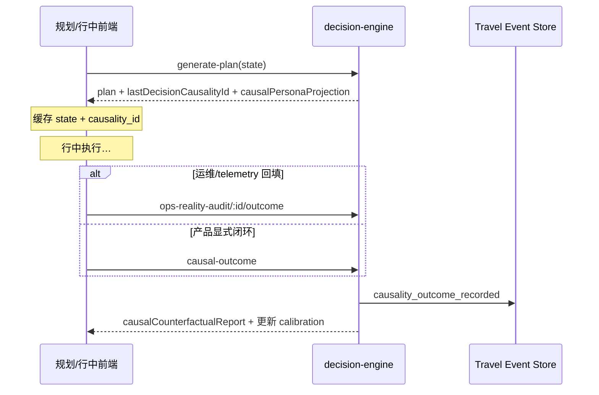

# Causal Travel Runtime · 前端对接指南

> 版本：P0–P5 · 2026-06  
> 类型 SSOT：`src/types/causal-travel-runtime.ts`  
> 文档镜像：[docs/frontend/causal-travel-runtime.types.ts](../frontend/causal-travel-runtime.types.ts)  
> API：`src/api/decision-engine.ts` · `src/api/planning-workbench.ts`  
> 会话缓存：`src/lib/causal-runtime-session.ts`  
> 观测工具：`src/lib/causal-observation.util.ts`  
> 行中 telemetry：`src/lib/causal-in-trip-telemetry.ts`  
> UI：`src/components/causal/CausalInsightPanel.tsx` · `InTripCausalInsightCard`

---

## 快速引用

```typescript
import { decisionEngineApi } from '@/api/decision-engine';
import { pickCausalPersonaProjection } from '@/api/planning-workbench';
import {
  saveCausalRuntimeSession,
  saveCausalRuntimeFromWorkbench,
  buildCausalOutcomeContext,
} from '@/lib/causal-runtime-session';
import {
  buildCausalObservation,
  shouldSkipLlmGuardianEval,
} from '@/lib/causal-observation.util';
import { CausalInsightPanel } from '@/components/causal';
```

---

## 前端测序

| 步 | 接口 | 必须 |
|----|------|------|
| ① | `POST /decision-engine/v1/generate-plan`（或 `repair-plan`） | 规划/修复时 |
| ② | 客户端缓存 `state` + `lastDecisionCausalityId` | 行中 outcome 前 |
| ③ | `POST .../ops-reality-audit/:id/outcome` **或** `POST .../causal-outcome` | 实况已知后 **一次** |



---

## 行中 telemetry 接线

| 触发点 | 文件 | 行为 |
|--------|------|------|
| 环境事件锁定 | `useInTripEnvironmentEvent.resolve` | `submitInTripCausalTelemetryForEnvironmentEvent` |
| Recovery loop 采纳 | `useInTripRecoveryLoop.apply` | `submitInTripCausalTelemetryForRecoveryLoop` |
| 徒步 generate-plan | `runHikingGeneratePlanWithCausalCache` @ `HikingTrailPlanSummaryCard` |
| 执行页提示 | `InTripCausalInsightCard` · `showPlanningHint`（冰岛） |

优先路径：`getOpsRealityByTrip` → 选未回填 snapshot → `postOpsRealityOutcomeWithCausalContext`  
兜底：session 有 `state` + `causality_id` 时走 `postCausalOutcome`  
全程 **fail-open**，不阻断行中主流程。

---

**POST** `/planning-workbench/execute`

响应 `data.uiOutput` 经 `normalizeWorkbenchUiOutput` 后含：

| 字段 | 类型 | UI 用途 |
|------|------|---------|
| `presentation` | `GuardianPersonaPresentation` | Banner / 主文案 |
| `causalPersonaProjection` | `CausalPersonaProjection` | 抽屉：因果链 + 证据 |

当 `causalPersonaProjection.kernelAuthoritative === true` 时：**禁止**再并行请求独立 LLM guardian eval；只渲染 projection 切片。

```typescript
const projection = pickCausalPersonaProjection(rawUiOutput);
if (shouldSkipLlmGuardianEval(projection)) {
  // 仅渲染 CausalInsightPanel / presentation
}
```

---

## 13.2 generate-plan / repair-plan · CausalRuntimeEcho

响应 `data` 除 `plan` / `log` 外，扩展 `CausalRuntimeEcho`：

- `lastDecisionCausalityId`
- `causalPersonaProjection`
- `icelandSelfDriveCausalAssessment`
- `icelandCausalCalibration`
- `causalCounterfactualSnapshot`

**必须**在 tick 结束后持久化：

```typescript
const state = buildGeneratePlanRequest(/* … */);
const data = await decisionEngineApi.generatePlan({ ...state, tripId });
saveCausalRuntimeSession(tripId, state, data);
```

> Agent 层（2026-06）：同进程且会话未过期时，OPS outcome 可不传 `state` / `causality_id`——服务端会从 `CausalRuntimeSessionService` 自动补齐。客户端缓存仍为多实例/跨重启场景的**推荐兜底**。

---

## 13.3 显式闭环 · causal-outcome

**POST** `/decision-engine/v1/causal-outcome`

```typescript
const ctx = buildCausalOutcomeContext(tripId);
if (!ctx) throw new Error('缺少因果会话缓存');

await decisionEngineApi.postCausalOutcome({
  ...ctx,
  metrics: { iceland_miss_prob: 1, iceland_p90_minutes: 168 },
  missed_appointment: true,
  narrative: '错过冰川团集合',
});
```

响应 `data`：`report` + `CausalRuntimeEcho` + `travelEventPersisted`

---

## 13.4 OPS outcome · 自动 P5

**POST** `/decision-engine/v1/ops-reality-audit/:snapshotId/outcome`

可选新增 body 字段：`causality_id`、`state`、`tripId`

推荐在 `outcome.extensions` 写入显式观测块：

```typescript
import { buildCausalObservation } from '@/lib/causal-observation.util';

await decisionEngineApi.postOpsRealityOutcomeWithCausalContext(snapshotId, {
  outcome: {
    schema: 'p-ops-2-outcome/v1',
    recordedAtIso: new Date().toISOString(),
    summary: '…',
    extensions: {
      causal_observation: buildCausalObservation({
        metrics: { iceland_miss_prob: 1, iceland_p90_minutes: 168 },
        missed_appointment: true,
        narrative: '错过冰川团集合',
      }),
    },
  },
  tripId,
});
```

`postOpsRealityOutcomeWithCausalContext` 会在缺少 `state` / `causality_id` 时从 session 缓存自动补齐。

响应 fail-open 扩展：`causalCounterfactualClosed`、`causalCounterfactualReport`、`travelEventPersisted`

---

## 13.6 UI · CausalInsightPanel

```tsx
<CausalInsightPanel
  projection={echo.causalPersonaProjection}
  counterfactual={report}
  iceland={echo.icelandSelfDriveCausalAssessment}
  calibration={echo.icelandCausalCalibration}
/>
```

必做：

1. 展示 `presentation.narrative`（单主角）
2. 展开层：`causalChain` 逐步列表（Abu / Neptune 切片）
3. 若存在 `counterfactualReport`：展示「预测 vs 实况」与 `userFacingAssessment`
4. 校准后 subtle badge：`模型已根据实况微调`（`icelandCausalCalibration.sampleCount > 0`）

---

## 14.2 Gate1 trust-surface · Plan B 卡

`GET /advisor/projects/:projectId/trust-surface` — Plan B 卡可选含 `causalChain`（P4）。

---

## 联调检查清单

- [ ] `generate-plan` 返回 `lastDecisionCausalityId` + `causalPersonaProjection`
- [ ] 规划工作台 `uiOutput.causalPersonaProjection.kernelAuthoritative` 为 true（冰岛/门控场景）
- [ ] OPS outcome 带 `causal_observation` → 响应 `causalCounterfactualClosed: true`
- [ ] 第二次 `generate-plan` 的 miss 估计随校准变化（同 wind 输入）
- [ ] Travel Event Store 可见成对事件：`causality_recorded` + `causality_outcome_recorded`

---

## 环境变量（服务端）

| 变量 | 默认 | 说明 |
|------|------|------|
| `CAUSAL_PERSONA_KERNEL` | `1` | 三人格读 kernel，跳过 LLM guardian |
| `CAUSAL_COUNTERFACTUAL_ON_OPS_OUTCOME` | `1` | OPS outcome 自动 P5 |
| `OPS_REALITY_AUDIT` | `0` | 启用预测快照 + outcome API |
| `TRAVEL_EVENT_STORE_ENABLED` | `false` | 持久化 causality 事件 |

完整模板见后端 `config/causal-travel-runtime.env.example`。
