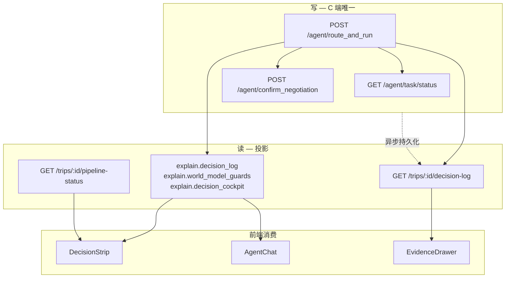

# 决策相关 API 审核矩阵

**文档类型**：API 审核 / 收敛清单  
**版本**：0.1.0  
**状态**：待评审（与后端联合签批）  
**编制**：产品 / 前端  
**受众**：后端、前端、测试、架构  
**关联文档**：
- `docs/prd/plan-studio-decision-strip-prd.md` — C 端读模型消费方
- `docs/api/user-frontend-integration.md` — C 端 BFF 边界
- `docs/api/decision-engine-prd.md` — decision-engine v1 契约
- `.claude/agents/AGENT-COLLABORATION.md` — Mode A / Mode B 分层

**最后更新**：2026-06-22

---

## 1. 审核目标

1. 确定 C 端 **决策写链** 与 **读模型** 的 **唯一真源**，消除 6 套并行叙事。
2. 为每条决策相关接口给出 **保留 / 收敛 / 专家 / 废弃倾向** 裁决，并标注前端引用。
3. 输出 **签批表**，作为 sunset 与迁移依据。

---

## 2. 架构原则（签批前共识）

| # | 原则 | 说明 |
|---|------|------|
| P1 | **写链唯一** | C 端用户触发的规划、改排、优化、门控 **默认** 只走 `POST /agent/route_and_run`（含 async + confirm） |
| P2 | **读模型分层** | 实时：`explain.*`（随 route_and_run）；历史：`GET /trips/:id/decision-log`；里程碑：`GET /trips/:id/pipeline-status` |
| P3 | **编排 vs 业务进度** | 编排七步 ≠ 业务 Pipeline 六步；文档与 UI 不得混用 |
| P4 | **专家 REST 下沉** | `/decision/*`、`planning-workbench/execute` 等不得作为 C 端默认路径 |
| P5 | **画像 ≠ 编排** | `decision-profiling` 是用户偏好，不是 `decision_log` 替代 |

---

## 3. 真源定义（目标态）

---

## 4. 接口矩阵总览

图例：

- **保留** — C 端主链或稳定读模型
- **收敛** — 合并到 route_and_run 或读模型，设 sunset
- **专家** — 高级 / Debug / 质检，不对普通用户默认暴露
- **待确认** — 需产品 + 后端签批
- **废弃倾向** — 前端无引用或重复，建议 sunset

---

## 5. A 族 — Agent 主链（`src/api/agent.ts`）

| 方法 | 路径 | 前端封装 | PM 裁决 | 前端引用（主要） |
|------|------|----------|---------|------------------|
| POST | `/agent/route_and_run` | `agentApi.routeAndRun` | **保留** | `AgentChat.tsx`, `executeRouteAndRun.ts`, `orchestrator.ts`, `ScheduleTab.tsx`, `GlobalCommandBar.tsx`, `AgentChatSidebar.tsx` |
| POST | `/agent/route_and_run/async` | `agentApi.routeAndRunAsync` | **保留** | `executeRouteAndRun.ts` |
| GET | `/agent/task/status/:taskId` | `agentApi.getTaskStatus` | **保留** | `executeRouteAndRun.ts`, `planningTaskStore` |
| POST | `/agent/task/resume/:taskId` | `agentApi.resumeTask` | **保留** | `executeRouteAndRun.ts` |
| POST | `/agent/confirm_negotiation` | `agentApi.confirmNegotiation` | **保留** | `AgentChat.tsx`, `NegotiationDialog` |
| POST | `/agent/actions/preview` | `agentApi.previewActions` | **保留** | `ActionExecutionPreviewPanel.tsx` |
| POST | `/agent/rollback` | `agentApi.rollback` | **保留** | Agent 改排回滚 |
| POST | `/agent/rollback_to_revision` | `agentApi.rollbackToRevision` | **保留** | 同上 |
| POST | `/agent/log_decision` | `agentApi.logDecision` | **待确认** | 需确认是否仍独立写日志 |
| GET | `/agent/trip/:tripId/itinerary_revision_timeline` | `agentApi.getItineraryRevisionTimeline` | **保留** | 改排历史 |
| GET | `/agent/trip/:tripId/robustness_dashboard` | `agentApi.getRobustnessDashboard` | **专家** | 折叠 / 高级 |
| GET | `/agent/negotiation_revision/:revisionId` | `agentApi.getNegotiationRevision` | **保留** | 协商详情 |
| GET | `/agent/route_and_run/constraints-meta` | `agentApi.getConstraintsMeta` | **保留** | 澄清/约束 UI |
| POST | `/agent/booking_cart/apply` | `agentApi.applyBookingCart` | **保留** | 预订购物车 |
| POST | `/agent/open_world_verification/apply` | `agentApi.applyOpenWorldVerification` | **保留** | 开放世界验证 |

### 5.1 响应字段（非独立 HTTP，但是读模型真源）

| 字段 | 说明 | PM 裁决 | 前端引用 |
|------|------|---------|----------|
| `explain.decision_log[]` | 编排逐步摘要 | **保留 #1** | `AgentChat`, `mergeRouteRunDecisionLogs`, `EvidenceDrawer` |
| `explain.world_model_guards` | 段编辑门控 | **保留 #2** | `worldModelGuardsStore`, `PlanningBanner`, Schedule 编辑能力 |
| `explain.optimization` | 优化 verdict / method | **保留** | `plan-studio/index.tsx`, Strip（M1） |
| `explain.decision_cockpit` | 驾驶舱投影 | **保留** | `DecisionCockpitPanel` |
| `result.status` | OK / NEED_* / FAILED | **保留** | `handleRouteAndRunResponse.ts` |
| `ui_state.phase` | OrchestrationStep | **保留** | `planningTaskStore`, `PlanningPipelineProgress` |
| `payload.suggested_operations` | 建议下一步 | **保留** | Strip 主 CTA |

**审核问题 A1**：`explain.decision_log` 与 `orchestrationResult.decision_log` 是否已规定 canonical 合并规则？（前端见 `route-run-contract-extract.ts`）

**审核问题 A2**：非 Agent 触发的 CRUD（手动改 itinerary）是否会 append 到 `trips/decision-log`？

---

## 6. B 族 — 行程读模型（`src/api/trips.ts`）

| 方法 | 路径 | 前端封装 | PM 裁决 | 前端引用 |
|------|------|----------|---------|----------|
| GET | `/trips/:id/decision-log` | `tripsApi.getDecisionLog` | **保留** | `EvidenceDrawer.tsx`, `trips/[id].tsx`, `DecisionLogSection.tsx`, Strip M2 |
| GET | `/trips/:id/pipeline-status` | `tripsApi.getPipelineStatus` | **保留** | `plan-studio/index.tsx`, `PipelineSection.tsx` |
| GET | `/trips/:id/persona-alerts` | `tripsApi.getPersonaAlerts` | **保留** | ScheduleTab, 三人格告警 |

**审核问题 B1**：`decision-log` 条目 schema 是否与 `explain.decision_log[]` **同构**？若否，需 BFF 投影层。

**审核问题 B2**：`pipeline-status.stages[].summary` 是否由最新 decision 投影自动生成？

---

## 7. C 族 — planning-workbench（`src/api/planning-workbench.ts`）

| 方法 | 路径 | PM 裁决 | 前端引用 |
|------|------|---------|----------|
| POST | `/planning-workbench/execute` | **收敛** | `PlanningWorkbenchTab.tsx`（Tab 已隐藏） |
| GET | `/planning-workbench/state/:planId` | **收敛** | `PlanningWorkbenchTab`, `PlanVariantsPage`, `DecisionDraftTabWrapper` |
| POST | `/planning-workbench/plans/:planId/commit` | **收敛** | `PlanningWorkbenchTab` |
| GET | `/planning-workbench/trips/:tripId` | **待确认** | 少用 |
| GET | `/planning-workbench/trips/:tripId/plans` | **收敛** | `PlanningWorkbenchTab`, `CurrentTripDecisionCard`, `ContinueEditingCard`, `budget.tsx`, `DecisionDraftTabWrapper` |
| GET | `/planning-workbench/plans/:planId` | **收敛** | Workbench |
| POST | `/planning-workbench/plans/compare` | **收敛** | `PlanningWorkbenchTab` |
| POST | `/planning-workbench/plans/:planId/adjust` | **收敛** | `PlanningWorkbenchTab` |
| POST | `/planning-workbench/budget/evaluate` | **收敛** | Workbench（经 evaluateBudget 封装） |
| GET | `/planning-workbench/budget/decision-log` | **收敛** | `PlanningWorkbenchTab` — 并入 `trips/decision-log` 或 GATE_EVAL |
| POST | `/planning-workbench/budget/apply-optimization` | **收敛** | `PlanningWorkbenchTab`, `budget.tsx` |
| GET | `/planning-workbench/plans/:planId/budget-evaluation` | **收敛** | `PlanningWorkbenchTab`, `CurrentTripDecisionCard`, `ContinueEditingCard` |
| GET | `/planning-workbench/trips/:tripId/readiness` | **收敛** | `PlanStudioSidebar.tsx`（侧栏已注释） |
| GET | `/planning-workbench/trips/:tripId/readiness/score` | **收敛** | 同上 |
| POST | `/planning-workbench/trips/:tripId/fetch-evidence` | **收敛** | `useAutoFetchEvidence.ts`, `readiness/index.tsx` |
| POST | `/planning-workbench/trips/:tripId/fetch-weather` | **待确认** | 是否并入 Agent RESEARCH |
| GET | `/planning-workbench/tasks/:taskId/progress` | **收敛** | `readiness/index.tsx` — 改 agent task status |
| POST | `/planning-workbench/tasks/:taskId/cancel` | **收敛** | `readiness/index.tsx` |
| POST | `/planning-workbench/auto-optimize` | **收敛** | `AutoOptimizeDialog.tsx` → `route_and_run` |

**Sunset 建议**：C 端新功能 **禁止** 新增对 C 族的依赖；M2 起按上表迁移。

**审核问题 C1**：`execute` 与 `route_and_run` 在后端是否同一编排？若否，以何者为 canonical？

**审核问题 C2**：预算 Gate 真源：`planning-workbench/budget/*` vs Agent `GATE_EVAL` — 二选一或并存策略？

---

## 8. D 族 — decision-engine v1（`src/api/decision-engine.ts`）

前缀：`/decision-engine/v1`

| 方法 | 路径 | PM 裁决 | 经 adapter 暴露 |
|------|------|---------|-----------------|
| POST | `/generate-plan` | **专家** | 否（C 端应 route_and_run） |
| POST | `/repair-plan` | **收敛** | 行中 repair → Agent REPAIR |
| POST | `/validate-safety` | **专家** | 是 |
| POST | `/check-constraints` | **专家** | 是 |
| POST | `/generate-multiple-plans` | **专家** | 是 → `PlanVariantsPage` |
| POST | `/explain-plan` | **专家** | 否 |
| POST | `/adjust-pacing` | **专家** | 是 |
| POST | `/replace-nodes` | **专家** | 是 |
| GET | `/health` | **保留** | 运维 |
| GET | `/operational-policy` | **专家** | Ops |
| POST | `/ops-reality-audit/:id/outcome` | **专家** | Ops |
| GET | `/ops-reality-audit/by-trip/:tripId` | **专家** | Ops |
| GET | `/ops-reality-audit/:id/replay-compare` | **专家** | Ops |

**切换开关**：`VITE_USE_DECISION_ENGINE_V1`（`decision-adapter.ts`）

**审核问题 D1**：生产环境该 env 默认值？legacy `/decision` sunset 日期？

---

## 9. E 族 — legacy `/decision`（`src/api/decision.ts`）

| 方法 | 路径 | PM 裁决 | 前端引用 |
|------|------|---------|----------|
| POST | `/decision/validate-safety` | **废弃倾向** | `PlanStudioSidebar` **直连**（应走 adapter） |
| POST | `/decision/adjust-pacing` | **废弃倾向** | 同上 |
| POST | `/decision/replace-nodes` | **废弃倾向** | 同上 |
| POST | `/decision/detect-conflicts` | **废弃倾向** | `NLChatInterface.tsx`, adapter 暴露 |
| POST | `/decision/check-constraints-with-explanation` | **废弃倾向** | adapter |
| POST | `/decision/generate-multiple-plans` | **废弃倾向** | adapter fallback |
| POST | `/decision/feedback/plan-variant` | **专家** | `PlanVariantFeedbackCard.tsx` |
| POST | `/decision/feedback/conflict` | **专家** | `ConflictFeedbackCard.tsx` |
| POST | `/decision/feedback/decision-quality` | **专家** | `DecisionQualityFeedbackCard.tsx` |
| POST | `/decision/feedback/batch` | **专家** | — |
| GET | `/decision/feedback/stats` | **专家** | `FeedbackStatsDashboard.tsx` |

**前端债务**：`PlanStudioSidebar.tsx` 绕过 `decisionAdapter` 直连 `decisionApi` — M2 删除或改 adapter。

---

## 10. F 族 — `/v1/decisions` REST（`src/api/decisions.ts`）

| 方法 | 路径 | PM 裁决 | 前端引用 |
|------|------|---------|----------|
| POST | `/v1/decisions` | **废弃倾向** | `useDecisions.ts` — **无页面使用 create 流** |
| GET | `/v1/decisions/:id` | **废弃倾向** | `useDecisions.ts` |
| GET | `/v1/decisions/:id/alternatives/:planId` | **废弃倾向** | `DecisionResultCard.tsx` — **组件未被任何页面 import** |
| POST | `/v1/decisions/:id/select` | **废弃倾向** | 同上 |
| POST | `/v1/decisions/:id/feedback` | **废弃倾向** | `DecisionFeedbackForm.tsx` → `trips/[id].tsx` 仅此一处 |
| GET | `/v1/decisions/:id/explanation` | **废弃倾向** | hook only |
| GET | `/v1/decisions/:id/explanation/natural` | **废弃倾向** | hook only |
| GET | `/v1/users/me/decisions` | **废弃倾向** | hook only |
| GET | `/v1/users/me/learning-progress` | **废弃倾向** | hook only |
| POST | `/v1/users/me/preferences/feedback` | **废弃倾向** | hook only |

**审核问题 F1**：该 REST 模型是否为独立产品「决策会话实体」？若否，建议 **sunset**，能力并入 route_and_run + decision-draft。

---

## 11. G 族 — decision-draft（`src/api/decision-draft.ts`）

| 方法 | 路径 | PM 裁决 | 前端引用 |
|------|------|---------|----------|
| GET | `/decision-draft/:draftId` | **专家** | `DecisionCardsGrid`, `useDecisionDraft` |
| GET | `/decision-draft/:draftId/explanation` | **专家** | `DraftExplanationView`, `DecisionExplanationSheet` |
| GET | `/decision-draft/:draftId/step/:stepId/explanation` | **专家** | `ExplanationPanel` |
| PATCH | `/decision-draft/:draftId/steps/:stepId` | **专家** | `useDecisionDraft` |
| POST | `/decision-draft/:draftId/preview-impact` | **专家** | `ImpactPreview` |
| GET | `/decision-draft/:draftId/replay` | **专家** | `ReplayController` |
| GET | `/decision-draft/:draftId/versions` | **专家** | `VersionViewer` |
| GET | `/decision-draft/:draftId/versions/:versionId` | **专家** | 同上 |
| GET | `/decision-draft/:draftId/versions/:v1/compare/:v2` | **专家** | 同上 |

**说明**：带 `mock-decision-draft-api` fallback；Plan Studio Tab 已移除。保留 **Studio / 专家** 路径，不进 C 端主链。

---

## 12. H 族 — trip-decision-profiling（`src/api/trip-decision-profiling.ts`）

前缀：`/trips/:tripId/decision-profiling/*`

| 能力 | PM 裁决 | 说明 |
|------|---------|------|
| onboarding / quiz / travel-style / money-dna | **保留** | 用户画像，非编排链 |
| friction-radar / split-consensus | **保留** | 团队协商输入 |
| reuse-profile / quiz-prefill | **保留** | 见 `decision-profiling-profile-reuse-prd.md` |

**硬规则**：不得与 `decision_log` 混为同一 UI 列表。

---

## 13. I 族 — optimization-v2（`src/api/optimization-v2.ts`）

前缀：`/optimization/*`、`/team/*`

| 方法 | 路径 | PM 裁决 | 前端引用 |
|------|------|---------|----------|
| POST | `/optimization/evaluate` | **收敛** | `PlanningWorkbenchTab` → route_and_run |
| POST | `/optimization/optimize` | **收敛** | 同上 |
| POST | `/optimization/negotiation` | **待确认** | Workbench — 单人协商 |
| POST | `/optimization/compare` 等 | **待确认** | 优化对比 |
| POST | `/team/:id/negotiate` | **保留** | TeamTab 多人协商 |
| GET | `/team/:id/constraints` 等 | **保留** | 团队设置 |

---

## 14. J 族 — 约束 / 可执行性 / 准备度

| 模块 | 代表路径 | 映射步骤 | PM 裁决 | 前端引用 |
|------|----------|----------|---------|----------|
| trip-constraint-solver | `GET /trips/:id/feasibility-report` 等 | VERIFY | **保留读模型** | `FeasibilityReportSheet` |
| readiness | `POST /readiness/check`, `GET /readiness/trip/:id` | 行前 | **保留** | `readiness/index.tsx` |
| readiness | `POST /readiness/repair-options` | REPAIR | **保留** | 修复工作流 |
| approvals | `POST /approvals/:id/decision` | 人工审批 | **保留** | 审批流 |

**审核问题 J1**：Feasibility report 是否应投影自最近一次 VERIFY 的 `decision_log`，而非独立计算？

---

## 15. K 族 — Agent 决策复盘（`src/api/agent.ts`）

| 方法 | 路径 | PM 裁决 | 前端引用 |
|------|------|---------|----------|
| GET | `/v1/decision-replay/timeline/:tripRunId` | **保留** | 行中 / 复盘（待接实） |
| POST | `/v1/decision-replay/what-if` | **专家** | — |
| POST | `/v1/decision-replay/counterfactual/:tripRunId` | **专家** | — |
| GET | `/v1/decision-replay/sessions` | **专家** | — |

`DecisionReplayPanel`（active-trip）当前为 mock，M3 接 K 族。

---

## 16. L 族 — WebSocket（`src/api/decision-websocket.ts`）

| 通道 | PM 裁决 | 前端引用 |
|------|---------|----------|
| `decision_progress` | **待确认** | 需确认是否与 `agent/task/status` 重复 |

---

## 17. 签批表（评审会议填写）

| # | 问题 | 选项 | 签批 | 负责人 |
|---|------|------|------|--------|
| 1 | C 端写链唯一 `route_and_run` | 是 / 否 | | |
| 2 | `planning-workbench/execute` sunset 日期 | YYYY-MM-DD / 保留专家 | | |
| 3 | 预算 Gate 真源 | Agent GATE_EVAL / workbench budget / 并存 | | |
| 4 | `trips/decision-log` ↔ `explain.decision_log` 同构 | 是 / 需投影 | | |
| 5 | legacy `/decision/*` sunset | YYYY-MM-DD / 保留 | | |
| 6 | `/v1/decisions` REST 路线图 | 废弃 / 保留 | | |
| 7 | `VITE_USE_DECISION_ENGINE_V1` 生产默认 | true / false | | |
| 8 | Decision Strip 读模型 | explain only / explain + decision-log | | |
| 9 | 业务 Pipeline vs 编排七步映射文档 | 产品 / 后端 | | |
| 10 | `decision-websocket` vs task poll | 保留 WS / 仅 poll | | |

---

## 18. 前端迁移清单（按优先级）

与 `plan-studio-decision-strip-prd.md` M2 对齐。

| 优先级 | 文件 | 当前调用 | 目标 |
|--------|------|----------|------|
| P0 | `PlanningWorkbenchTab.tsx` | 假进度 + `execute` | 移除或仅专家入口；进度接 task store |
| P0 | `AutoOptimizeDialog.tsx` | `auto-optimize` | `invokeRouteAndRun` |
| P1 | `CurrentTripDecisionCard.tsx` | `getTripPlans` + budget eval | `getDecisionLog` 摘要 |
| P1 | `ContinueEditingCard.tsx` | 同上 | 同上 |
| P1 | `PlanStudioSidebar.tsx` | 直连 `decisionApi` | 删除或 adapter + 专家模式 |
| P2 | `pages/trips/budget.tsx` | `applyBudgetOptimization` | Agent suggested op |
| P2 | `NLChatInterface.tsx` | `detect-conflicts` | route_and_run 或 adapter v1 |
| P3 | `useDecisions.ts` + components | `/v1/decisions` | sunset 后删除 |
| P3 | `PlanningWorkbenchTab` 整体 | 多 endpoint | 评估是否仅保留 Storybook / admin |

---

## 19. 附录：编排步骤 ↔ 三人格 ↔ UI 映射

| OrchestrationStep | 用户文案 | 主要负责 | Strip running 展示 |
|-------------------|----------|----------|-------------------|
| INTENT_COMPILE | 意图编译 | Planner | ✓ |
| INTAKE | 需求接入 | Planner | ✓ |
| RESEARCH | 数据调研 | LocalInsight | ✓ |
| POI_SELECTION | 兴趣点选择 | Planner | ✓ |
| GATE_EVAL | 门禁评估 | Abu | ✓ |
| PLAN_GEN | 方案生成 | Planner | ✓ |
| VERIFY | 可执行性验证 | Compliance | ✓ |
| REPAIR | （合并展示） | Neptune | 并入 VERIFY |
| NARRATE | 决策叙事 | Narrator | ✓ |

| 业务 Pipeline stage（示例） | 与编排关系 |
|----------------------------|------------|
| 明确旅行目标 | 覆盖 INTAKE 之前产品态 |
| 判断路线是否成立 | 对应 GATE_EVAL 结论 |
| 生成可执行日程 | 对应 PLAN_GEN + VERIFY |
| 风险评估与缓冲 | VERIFY + REPAIR |
| Plan B | Neptune 替代方案 |
| 行前准备 | readiness，非编排步 |

---

## 20. 附录：相关代码索引

| 能力 | 路径 |
|------|------|
| Agent API | `src/api/agent.ts` |
| 统一执行 + 轮询 | `src/lib/executeRouteAndRun.ts` |
| 响应分发 | `src/lib/handleRouteAndRunResponse.ts` |
| decision_log 合并 | `src/lib/route-run-contract-extract.ts` |
| 门控 store | `src/store/worldModelGuardsStore.ts` |
| 进度 store | `src/store/planningTaskStore.ts` |
| 进度 UI | `src/components/agent/PlanningPipelineProgress.tsx` |
| Adapter | `src/api/decision-adapter.ts` |
| C 端集成说明 | `docs/api/user-frontend-integration.md` |
