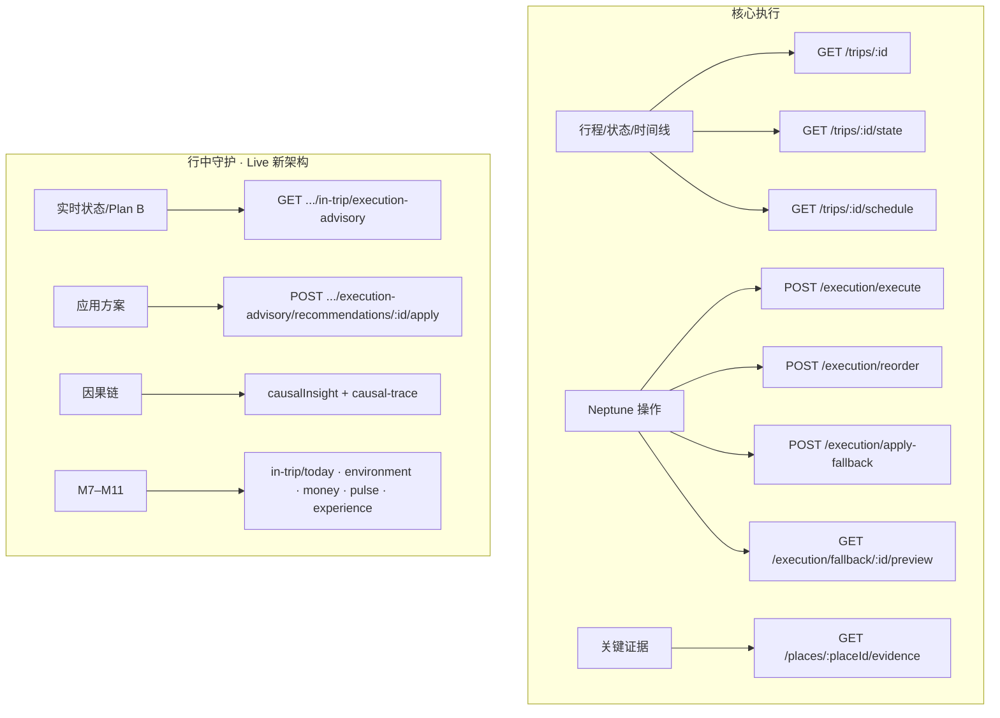

# 执行阶段页面 · 后端开发任务单

**日期：** 2026-07-07  
**页面：** `/dashboard/execute`  
**前端入口：** `src/pages/execute/index.tsx`  
**Global prefix：** `/api`  
**统一响应：** `{ success: boolean, data?: T, error?: { code, message } }`

**关联文档：**

- [trip-constraint-solver-read-models-api.md](./trip-constraint-solver-read-models-api.md)
- [execute-phase-causal-chain-handoff.md](./execute-phase-causal-chain-handoff.md)
- [execute-phase-frontend-handoff.md](./execute-phase-frontend-handoff.md)
- [in-trip-execution-m7-api.md](./in-trip-execution-m7-api.md)
- [decision-execution-space-handoff.md](./decision-execution-space-handoff.md)

**前端类型 SSOT：**

- `src/types/trip-execution-advisory.ts` → `TripExecutionAdvisoryDto`
- `src/api/execution.ts` → Neptune 执行 Agent
- `src/api/places.ts` → `PlaceEvidenceResponse`

---

## 1. 页面模块 → 接口映射



---

## 2. Sprint 分组建议

| Sprint | 任务 ID | 目标 |
|--------|---------|------|
| **S1 · P0** | T-01 ~ T-03 | 行中守护读模型 + 状态增强，去掉前端 Mock |
| **S2 · P1** | T-04 ~ T-06 | 写操作闭环（应用 Plan B / 变更 / 证据） |
| **S3 · P2** | T-07 ~ T-09 | Legacy Neptune 补齐或收敛到决策写链 |

### 最小可交付路径（MVP）

若资源有限，**只做 4 项即可让 Live 页脱离 Mock**：

1. **T-01** — `execution-advisory` 含真实 `recommendations`
2. **T-02** — `causalInsight` 强风因果链
3. **T-04** — 应用推荐方案写回
4. **T-03** — `nextStop` 坐标 + ETA

T-06 ~ T-09（Legacy Neptune）可与决策写链收敛合并，不作为 Live 新 UI 的阻塞项。

---

## 3. 任务详情

### T-01 · 行中执行守护读模型（P0）

| 项 | 值 |
|----|-----|
| **方法/路径** | `GET /api/trips/:tripId/in-trip/execution-advisory` |
| **Swagger Tag** | `trip-constraint-solver` |
| **前置条件** | `IN_TRIP_EXECUTION_ENABLED=true` 且 `trip.status=TRAVELING` |
| **前端消费** | `tripConstraintSolverApi.getExecutionAdvisory` → `useTripExecutionAdvisory` → Live 顶栏 / 右栏 / `ExecutionAdvisorySheet` |
| **替代现状** | 404/501 时前端用 `today + state + environment/events + predict` adapter 拼装 |

#### 响应契约 `TripExecutionAdvisoryDto`

```typescript
interface TripExecutionAdvisoryDto {
  tripId: string;
  tripDayId?: string;
  dayNumber: number;
  date: string;                    // YYYY-MM-DD
  routeSummary?: string;

  currentState: {
    currentTime: string;           // ISO 8601
    currentLocation?: { lat: number; lng: number };
    activeItemId?: string;
    delayMinutes: number;
  };

  verdict: {
    status: 'ON_TRACK' | 'AT_RISK' | 'REPLAN_REQUIRED' | 'STOP';
    headline: string;              // 用户语言，禁止技术词
    validUntil?: string;           // ISO，建议刷新时间
  };

  impacts: {
    affectedItems: Array<{
      itemId: string;
      title: string;
      status: 'completed' | 'active' | 'upcoming' | 'at_risk';
      projectedArrival?: string;
      note?: string;
    }>;
    estimatedHotelArrival?: string;
    drivingAfterDarkRisk?: number; // 0–1
  };

  deviations: Array<{ id: string; message: string; minutesImpact?: number }>;

  recommendations: Array<{        // ≤3 条，必须含 keep
    id: string;
    label: string;
    description: string;
    isRecommended?: boolean;
    impactSummary?: string;
    estimatedHotelArrival?: string;
    drivingAfterDarkRisk?: number;
    actionType: 'shorten' | 'skip' | 'reroute' | 'keep' | 'replace';
  }>;

  realtimeRisks: {
    road?: string;
    weather?: string;
    openingHours?: string;
    nextCheckAt?: string;
  };

  evidence: {
    weatherAsOf?: string;
    roadAsOf?: string;
    openingHoursAsOf?: string;
  };

  technicalFindings?: Array<{
    id: string;
    type: string;
    message: string;
    score?: number;
  }>;

  causalInsight?: ExecutionCausalInsightDto;  // 见 T-02
}
```

#### 错误码

| code | HTTP | 场景 |
|------|------|------|
| `EXECUTION_ADVISORY_DISABLED` | 403 | 模块未开 |
| `EXECUTION_ADVISORY_NOT_IN_TRIP` | 403 | 非 TRAVELING |
| `RECOMMENDATION_EXPIRED` | 200 | `validUntil` 过期仍返回 200，headline 提示重评 |

#### 聚合来源（建议）

```
AnchorHandoff(today timeline)
  + TripState(delay/GPS)
  + EnvironmentRadar(open events)
  + Realtime predict(weather/feasibility)
  + Constraint re-check(today scope)
  → recommendations ≤3 + verdict + impacts
```

#### 验收标准

- [ ] `TRAVELING` 行程返回完整 DTO；非行中返回 `EXECUTION_ADVISORY_NOT_IN_TRIP`
- [ ] `recommendations` 1–3 条，**至少含 1 条 `actionType=keep`**
- [ ] 每条非 keep 推荐含 `impactSummary`；推荐项含 `estimatedHotelArrival` 或 `drivingAfterDarkRisk`
- [ ] `verdict.headline` 无 CGUS / scheduleFeasibility 等技术词
- [ ] 前端右栏 Plan B **不再落** `DEFAULT_PLANS`（`src/lib/execute-decision-sidebar.util.ts`）
- [ ] 轮询 30s 内响应 P95 < 2s

---

### T-02 · 行中因果链 `causalInsight`（P0）

| 项 | 值 |
|----|-----|
| **归属** | `TripExecutionAdvisoryDto.causalInsight`（非独立 HTTP） |
| **前端消费** | `normalizeTripExecutionAdvisory` → `useExecuteCausalInsight` → `ExecuteCausalInsightPanel` |
| **Tier-3 降级** | 仅 `linkedProblemId` 无 `chain[]` 时，前端懒拉 `GET .../decision-problems/:id/causal-trace` |

#### 字段契约

```typescript
interface ExecutionCausalInsightDto {
  guardianHeadline: string;
  primaryEnforcement: 'ADJUST_REQUIRED' | 'NOT_EXECUTABLE';
  causalStory: {
    chain: Array<{
      nodeId: string;
      type: string;        // WEATHER | TRAVEL_TIME | RESERVATION | DECISION 等
      title: string;
      description: string;
      sourceRefs?: string[];
    }>;
    assessment: string;    // 决策冲突 / 最小干预建议
  };
  linkedProblemId?: string; // Tier-3 追溯用
}
```

#### Banner 映射

| `primaryEnforcement` | 前端 Alert Banner |
|----------------------|-------------------|
| `NOT_EXECUTABLE` | `BLOCK` |
| `ADJUST_REQUIRED` | `REQUIRE_ADJUSTMENT` |

#### 节点语义（强风场景 SSOT）

| 顺序 | type 示例 | 内容 |
|------|-----------|------|
| 1 | `WEATHER` | 阵风 / 风速 |
| 2 | `TRAVEL_TIME` / `ROUTE` | P90 通行增加 |
| 3 | `RESERVATION` / `BOOKING` | 预约错过概率 |
| 4 | `DECISION` | 路段详情 + 最小干预 |

**规则：** 交通缓冲等指标只在 plan-diff 表，**不进**因果链节点。

#### 聚合流水线

```
open environment event(wind)
  → 关联 open decision problem
  → 投影 guardianCausalStoryView + causalStoryView.chain
  → 写入 causalInsight
```

#### 验收标准

- [ ] `AT_RISK` / `REPLAN_REQUIRED` 时 `causalInsight.causalStory.chain` ≥ 3 步
- [ ] `guardianHeadline` 与 `assessment` 不重复全文
- [ ] 有完整 `chain[]` 时，前端**不触发** Tier-3 causal-trace
- [ ] 无因果数据时省略 `causalInsight`，概览 Tab 空态，不阻塞 Plan B

---

### T-03 · 行程状态增强 `nextStop`（P0）

| 项 | 值 |
|----|-----|
| **方法/路径** | `GET /api/trips/:tripId/state` |
| **前端消费** | `tripsApi.getState` → 下一步卡片、导航、地图、ETA |
| **问题** | 缺坐标导致「无法获取目的地坐标」toast |
| **调用约定** | 前端直接 `GET /state`，从 `nextStop.Place.latitude/longitude` 导航；**无需**传 `STATE_NOW` / `now` |

#### 增强字段

```typescript
interface TripState {
  currentDayId: string | null;
  currentItemId: string | null;
  nextStop: {
    itemId: string;
    placeId: number;
    placeName: string;
    startTime: string;              // ISO
    estimatedArrivalTime?: string;  // ISO，必须计算
    Place?: {
      id: number;
      nameEN: string;
      nameCN?: string;
      latitude: number;             // 必须
      longitude: number;            // 必须
      address?: string;
      businessHours?: { open: string; close: string; timezone?: string };
    };
  } | null;
  eta?: string;
  timezone: string;
  now: string;
}
```

#### 验收标准

- [ ] `nextStop` 存在时 `Place.latitude/longitude` 非空
- [ ] `estimatedArrivalTime` 基于当前延误 + 路况预测可展示
- [ ] 前端 Google Maps 导航不再因缺坐标失败
- [ ] 可与 T-05 二选一：此处含 `businessHours` 则可暂不单独调 evidence

---

### T-04 · 应用行中推荐方案（P1）

| 项 | 值 |
|----|-----|
| **方法/路径** | `POST /api/trips/:tripId/in-trip/execution-advisory/recommendations/:recommendationId/apply` |
| **前端现状** | `ExecuteDecisionSidebar.onApplyPlan` 目前仅 `toast.info`，**待接入** |
| **写链关系** | Gateway ON 时优先此路径或决策空间 `resolutions → apply` |

#### 请求

```json
{
  "confirm": true,
  "clientTimestamp": "2026-07-15T14:25:00+00:00"
}
```

#### 响应

```json
{
  "applied": true,
  "executionAdvisory": {},
  "scheduleMutations": [
    { "type": "SHORTEN_STAY", "itemId": "item-poi-2", "deltaMinutes": -30 }
  ],
  "updatedSchedule": {
    "date": "2026-07-15",
    "schedule": {
      "items": [
        {
          "placeId": 1,
          "placeName": "斯科加瀑布",
          "startTime": "2026-07-15T15:00:00+00:00",
          "endTime": "2026-07-15T15:30:00+00:00",
          "status": "upcoming"
        }
      ]
    }
  }
}
```

> `executionAdvisory` 为最新 `TripExecutionAdvisoryDto`，结构与 T-01 一致。

#### 错误码

| code | 场景 |
|------|------|
| `RECOMMENDATION_EXPIRED` | `validUntil` 已过，需重新 GET advisory |
| `RECOMMENDATION_NOT_FOUND` | id 无效 |
| `WRITE_CHAIN_BLOCKED` | 应走 decision-problems apply |

#### 验收标准

- [ ] 应用 `rec-shorten-*` 后当日 schedule 时间线更新
- [ ] 响应含最新 `executionAdvisory`，前端轮询可立即刷新右栏
- [ ] `actionType=keep` 返回 400 或明确 no-op 提示
- [ ] 前端接入后：右栏「应用此方案」完成写回，不再只弹 toast
- [ ] 与决策写链：同一变更可通过 `linkedProblemId` 记入 decision-log

---

### T-05 · 地点关键证据（P1）

| 项 | 值 |
|----|-----|
| **方法/路径** | `GET /api/places/:placeId/evidence` |
| **Query** | `date?` `includeWeather?=true` `includeTraffic?=true` |
| **前端消费** | `placesApi.getEvidence` → `loadPlaceEvidence` |
| **替代方案** | 增强 T-03 `nextStop.Place` 含同类字段，可免独立接口 |

#### 响应契约

```typescript
interface PlaceEvidenceResponse {
  placeId: number;
  placeName: string;
  evidence: {
    businessHours?: {
      open: string;
      close: string;
      timezone: string;
      exceptions?: Array<{
        date: string;
        open?: string;
        close?: string;
        closed?: boolean;
        note?: string;
      }>;
    };
    roadClosure?: {
      hasClosure: boolean;
      closures?: Array<{
        date: string;
        reason: string;
        affectedRoutes?: string[];
        alternativeRoutes?: string[];
      }>;
    };
    weatherWindow?: {
      date: string;
      condition: string;
      description: string;
      temperature: { min: number; max: number; unit: 'celsius' | 'fahrenheit' };
      precipitation?: { probability: number; amount?: number };
      wind?: { speed: number; direction: string };
      suitableForOutdoor?: boolean;
    };
    otherInfo?: {
      crowdLevel?: 'low' | 'medium' | 'high';
      specialEvents?: Array<{ date: string; name: string; impact?: string }>;
    };
  };
}
```

#### 验收标准

- [ ] `nextStop.placeId` 有对应 evidence；404 时前端有明确空态（非静默）
- [ ] `date` 参数影响 `businessHours.exceptions` / `weatherWindow`
- [ ] 冰岛场景 `wind.speed` 可用于顶栏风速展示补充

---

### T-06 · Neptune 执行 Agent · 变更与提醒（P1）

| 项 | 值 |
|----|-----|
| **方法/路径** | `POST /api/execution/execute` |
| **前端消费** | `executionApi.execute` — `get_status` / `remind` / `handle_change` / `fallback` |
| **现状** | 前端有 404/500 容错；后端可能未实现 |

#### Action 矩阵

| action | 用途 | 超时建议 |
|--------|------|----------|
| `get_status` | 轮询执行相位 | 60s |
| `remind` | 提醒列表 | 60s |
| `handle_change` | 延迟 / 跳过 | 120s |
| `fallback` | 触发修复，返回方案 | 120s |

#### 请求示例 · 延迟 15 分钟

```json
{
  "tripId": "uuid",
  "action": "handle_change",
  "changeParams": {
    "changeType": "schedule_change",
    "changeDetails": {
      "reason": "用户请求延迟15分钟",
      "delayMinutes": 15,
      "itemId": "item-uuid"
    }
  }
}
```

#### 请求示例 · 获取提醒

```json
{
  "tripId": "uuid",
  "action": "remind",
  "remindParams": {
    "reminderTypes": ["departure", "transport", "weather"],
    "advanceHours": 24
  }
}
```

#### 请求示例 · 触发修复

```json
{
  "tripId": "uuid",
  "action": "fallback",
  "fallbackParams": {
    "triggerReason": "用户请求替换当前活动",
    "itemId": "item-uuid"
  }
}
```

#### 响应增强（必须）

```typescript
interface ExecuteExecutionResponse {
  executionState: {
    tripId: string;
    phase: 'ON_TRIP' | 'CHANGE_HANDLING' | 'FALLBACK';
    currentDay: number;
    currentDate: string;
    reminders: Array<{
      id: string;
      type: string;
      title: string;
      message: string;
      triggerTime: string;
      priority: 'low' | 'medium' | 'high' | 'urgent';
    }>;
    pendingChanges: NeptuneChangePayload[];
    activeFallbacks: unknown[];
    lastUpdated: string;
  };
  uiOutput: {
    reminders?: Reminder[];
    changeResult?: {
      success: boolean;
      message?: string;
      updatedSchedule?: {
        date: string;
        schedule: {
          items: Array<{
            placeId: number | string;
            placeName: string;
            startTime: string;
            endTime: string;
            status?: 'upcoming' | 'in_progress' | 'completed' | 'cancelled';
          }>;
        };
      };
    };
    fallbackPlan?: {
      id: string;
      solutions: Array<{
        id: string;
        type: 'minimal' | 'experience' | 'safety';
        title: string;
        description: string;
        changes: Array<{
          itemId: string;
          action: 'modify' | 'remove' | 'add';
          newTime?: string;
          newPlace?: unknown;
        }>;
        impact: {
          arrivalTime: string;
          missingPlaces: number;
          riskChange: 'low' | 'medium' | 'high';
        };
        recommended?: boolean;
      }>;
    };
  };
}
```

#### 验收标准

- [ ] 接口存在且非 404；500 有明确 `error.code`
- [ ] `remind` 返回 `uiOutput.reminders` 或 `executionState.reminders`
- [ ] `handle_change` 成功后返回 `updatedSchedule`，前端时间线即时更新
- [ ] `fallback` 返回 ≥1 个 `solutions`，前端 Neptune Sheet 不再纯硬编码
- [ ] `delayMinutes` 字段被后端识别并落库

---

### T-07 · 重新排序行程（P2 · Legacy）

| 项 | 值 |
|----|-----|
| **方法/路径** | `POST /api/execution/reorder` |
| **前端消费** | `ReorderScheduleDialog` → `executionApi.reorder` |
| **写链** | Gateway ON 时前端拦截，引导决策空间 |

#### 请求

```json
{
  "tripId": "uuid",
  "dayId": "day-uuid",
  "newOrder": ["item-3", "item-1", "item-2"],
  "reason": "用户调整顺序"
}
```

#### 响应

```json
{
  "success": true,
  "message": "行程顺序已更新",
  "updatedSchedule": {
    "date": "2026-07-15",
    "schedule": {
      "items": [
        { "placeId": 1, "placeName": "...", "startTime": "...", "endTime": "..." }
      ]
    }
  },
  "impact": {
    "timeAdjustments": [
      { "itemId": "item-1", "originalTime": "10:00", "newTime": "11:30" }
    ],
    "conflicts": [
      { "type": "opening_hours", "message": "调整后可能错过营业时间" }
    ]
  }
}
```

#### 验收标准

- [ ] 拖拽排序后 schedule 持久化
- [ ] 冲突检测返回 `impact.conflicts`
- [ ] 写链开启时返回 `WRITE_CHAIN_BLOCKED` 或前端引导至 `decision-problems`

---

### T-08 · 应用 / 预览 Neptune 修复方案（P2 · Legacy）

#### T-08a · 应用

| 项 | 值 |
|----|-----|
| **方法/路径** | `POST /api/execution/apply-fallback` |
| **前端消费** | `handleApplySolution` → `executionApi.applyFallback` |

**请求：**

```json
{ "tripId": "uuid", "solutionId": "sol-minimal-1", "confirm": true }
```

**响应：**

```json
{
  "success": true,
  "message": "修复方案已应用",
  "appliedChanges": [
    { "itemId": "item-1", "action": "modified", "details": {} }
  ],
  "updatedSchedule": {
    "date": "2026-07-15",
    "schedule": { "items": [] }
  },
  "impact": {
    "arrivalTime": "10:15 (+15分钟)",
    "missingPlaces": 0,
    "riskChange": "low"
  }
}
```

#### T-08b · 预览

| 项 | 值 |
|----|-----|
| **方法/路径** | `GET /api/execution/fallback/:solutionId/preview` |
| **前端消费** | `FallbackSolutionPreviewDialog` → `executionApi.previewFallback` |

**响应：**

```json
{
  "solutionId": "sol-minimal-1",
  "type": "minimal",
  "title": "最小改动",
  "description": "仅调整到达时间",
  "changes": [
    {
      "itemId": "item-1",
      "action": "modify",
      "original": { "placeName": "A", "startTime": "10:00", "endTime": "11:00" },
      "modified": { "placeName": "A", "startTime": "10:15", "endTime": "11:15" },
      "reason": "延迟 15 分钟"
    }
  ],
  "impact": {
    "arrivalTime": "10:15 (+15分钟)",
    "missingPlaces": 0,
    "riskChange": "low"
  },
  "timeline": {
    "date": "2026-07-15",
    "schedule": {
      "items": [
        {
          "placeId": 1,
          "placeName": "A",
          "startTime": "10:15",
          "endTime": "11:15",
          "status": "modified"
        }
      ]
    }
  }
}
```

#### 验收标准

- [ ] 预览 Dialog 可展示 before/after 时间线
- [ ] 应用后 `todaySchedule` 与 `tripState` 一致
- [ ] Neptune `::alt::` 方案可走 `handle_change` 确认路径（前端已有分支）

---

### T-09 · 推荐方案预览（P2 · 新架构）

| 项 | 值 |
|----|-----|
| **方法/路径** | `GET /api/trips/:tripId/in-trip/execution-advisory/recommendations/:id/preview` |
| **用途** | Plan B 后果对比（可与 GET advisory 合并返回） |
| **前端** | 尚未接入；可在 `ExecutionAdvisorySheet` 复用 `DecisionBeforeAfterPanel` 模式 |

#### 验收标准

- [ ] 返回修改前/后 schedule diff + `drivingAfterDarkRisk` 变化
- [ ] 或：GET advisory 的 `recommendations[]` 已含足够 impact 字段，产品确认可免独立 preview 接口

---

## 4. 写链收敛说明

当 `VITE_DECISION_GATEWAY_UNIFIED=1` 时，以下 Legacy 直写**不应**作为 C 端主路径：

| Legacy 接口 | 收敛目标 |
|-------------|----------|
| `POST /execution/reorder` | `decision-problems` → `POST .../resolutions` → `POST .../apply` |
| `POST /execution/apply-fallback` | 同上，或 T-04 `recommendations/:id/apply` |
| `POST /execution/execute` (fallback) | 触发决策问题 + 方案预览写链 |

后端需统一返回 `WRITE_CHAIN_BLOCKED`（或 409 + code），前端已有 `handleWriteChainBlockedError` 引导至决策空间。

---

## 5. 已对接模块（参考，非本任务单范围）

以下模块文档标注后端 controller 已同步，执行页已集成。需 `IN_TRIP_EXECUTION_ENABLED=true`：

| 模块 | 路径前缀 | 文档 |
|------|----------|------|
| M7 锚点 / Today | `/trips/:id/in-trip/today` 等 | [in-trip-execution-m7-api.md](./in-trip-execution-m7-api.md) |
| M8 环境雷达 | `/trips/:id/in-trip/environment/*` | 同上 |
| M9 Money Brain | `/trips/:id/in-trip/money/*` | [in-trip-money-m9-api.md](./in-trip-money-m9-api.md) |
| M10 Pulse / Split | `/trips/:id/in-trip/pulse/*`、`/split/*` | [in-trip-pulse-split-m10-api.md](./in-trip-pulse-split-m10-api.md) |
| M11 Experience Loop | `/trips/:id/in-trip/experience/*` | [in-trip-experience-m11-api.md](./in-trip-experience-m11-api.md) |
| 优化 V2 实时 | `/v2/realtime/state/:id` | `src/api/optimization-v2.ts` |

**已知 stub：** M7 文档标注「实时气温」为 stub，非真实气象。

---

## 6. 前端 Mock 降级点（联调对照）

| 区域 | 降级表现 | 依赖任务 |
|------|----------|----------|
| 右栏 Plan B | `DEFAULT_PLANS` 硬编码 | T-01 |
| 因果链概览 Tab | 空态或 Tier-3 trace | T-02 |
| 中栏拆队/时间线 | `DEMO_TIMELINE` 等 | split + schedule 真实数据 |
| 紧急联系人 | 硬编码导游/112 | 无对应接口（产品待定） |
| AI 建议文案 | 默认「Plan B-1 推迟徒步…」 | T-01 `verdict` + `realtimeRisks` |
| 应用 Plan B 按钮 | 仅 `toast.info` | T-04 + 前端接入 |

---

## 7. 联调签字表

| 任务 | 后端 Owner | 前端 Owner | 联调日期 | 签字 |
|------|------------|------------|----------|------|
| T-01 execution-advisory | | | | ☐ |
| T-02 causalInsight | | | | ☐ |
| T-03 state.nextStop | | | | ☐ |
| T-04 apply recommendation | | | | ☐ |
| T-05 place evidence | | | | ☐ |
| T-06 execution/execute | | | | ☐ |
| T-07 reorder | | | | ☐ |
| T-08 apply/preview fallback | | | | ☐ |
| T-09 recommendation preview | | | | ☐ |

---

*文档版本：v1.0 · 2026-07-07*
