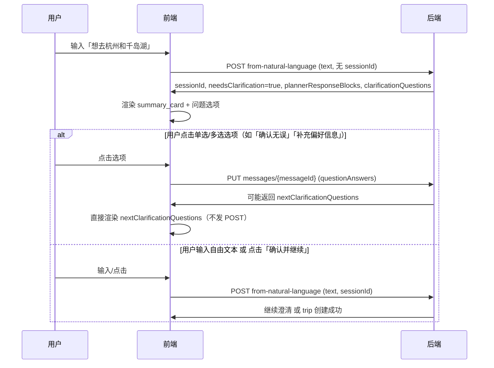

# 自然语言创建行程接口文档

## 概述

通过自然语言描述创建行程，由大模型解析需求并转换为行程参数。支持多轮澄清对话、分层采集（硬约束→风格→节奏→风险）、推断信息确认等能力。

**Base URL**: `{host}/api`（例如 `http://localhost:3000/api`）

**Swagger 文档**: `http://localhost:3000/api-docs`

---

## 1. 创建/继续对话（主入口）

### POST `/api/trips/from-natural-language`

使用自然语言描述创建行程或继续已有对话。系统会自动解析需求，并在信息不足时返回澄清问题。

#### 请求头

| 参数 | 类型 | 必填 | 说明 |
|------|------|------|------|
| Content-Type | string | 是 | `application/json` |
| Authorization | string | 否 | Bearer Token，未登录时可用 `X-Test-User-Id` 测试 |
| X-Test-User-Id | string | 否 | 测试用，免登录调用（如 `test-user-123`） |

#### 请求体

```json
{
  "text": "想去杭州和千岛湖，春日小度假",
  "sessionId": "nl_user123_abc12345",
  "isNewConversation": false,
  "llmProvider": "DEEPSEEK"
}
```

| 字段 | 类型 | 必填 | 说明 |
|------|------|------|------|
| text | string | **是** | 自然语言输入，如「帮我规划带娃去东京5天的行程，预算2万」 |
| sessionId | string | 否 | 会话 ID，不传则创建新会话；传且存在则继续对话 |
| isNewConversation | boolean | 否 | 是否开始新对话，`true` 时清空旧上下文 |
| llmProvider | string | 否 | LLM 提供商，如 `DEEPSEEK`、`OPENAI` |

#### 响应格式（统一包装）

```json
{
  "success": true,
  "data": { ... }
}
```

#### 成功响应 data 结构

**场景 A：需要澄清（needsClarification = true）**

```json
{
  "sessionId": "nl_xxx",
  "needsClarification": true,
  "plannerResponseBlocks": [
    {
      "type": "highlight",
      "highlightType": "info",
      "highlightText": "📋 第一阶段：请确认以下基础信息"
    },
    {
      "type": "summary_card",
      "summary": {
        "destination": "中国",
        "duration": "2026-03-20 至 2026-03-25",
        "startDate": "2026-03-20",
        "endDate": "2026-03-25",
        "travelers": "未指定",
        "budget": { "amount": 8000, "currency": "CNY" }
      }
    },
    {
      "type": "question_card",
      "questionId": "confirm_inferred_info"
    }
  ],
  "clarificationQuestions": [
    {
      "id": "confirm_inferred_info",
      "question": "请确认以上出行时间、返程时间、预算等信息是否正确，或选择需要调整的项",
      "type": "single_choice",
      "options": [
        { "value": "confirm", "label": "确认无误" },
        { "value": "不准确，需要修改日期", "label": "不准确，需要修改日期" },
        { "value": "预算需要调整", "label": "预算需要调整" },
        { "value": "其他需要修改", "label": "其他需要修改" }
      ],
      "required": false,
      "group": "required",
      "conditionalInputs": [
        {
          "triggerValue": "不准确，需要修改日期",
          "inputType": "date_range",
          "label": "请选择行程日期范围",
          "paramKey": "date_range",
          "required": true
        },
        {
          "triggerValue": "预算需要调整",
          "inputType": "number",
          "label": "请输入总预算（元）",
          "paramKey": "total_budget",
          "required": true,
          "validation": { "min": 1, "max": 10000000 }
        },
        {
          "triggerValue": "其他需要修改",
          "inputType": "text",
          "label": "请描述您想调整的内容",
          "paramKey": "other",
          "required": false
        }
      ]
    }
  ],
  "plannerReply": "请确认以上信息是否正确。",
  "partialParams": { "destination": "CN", "startDate": "...", "endDate": "...", "totalBudget": 8000 },
  "destination": "CN",
  "destinationName": "中国",
  "lastMessageId": "msg_xxx",
  "phaseIndicator": {
    "phase": 1,
    "phaseName": "硬约束确认",
    "progress": "1/4",
    "totalPhases": 4
  },
  "progressSteps": [
    { "id": "phase1", "label": "第一阶段：硬约束确认", "status": "running", "detail": "1 个问题待确认" },
    { "id": "phase2", "label": "第二阶段：风格选择", "status": "pending" },
    { "id": "phase3", "label": "第三阶段：节奏校准", "status": "pending" },
    { "id": "phase4", "label": "第四阶段：风险偏好", "status": "pending" }
  ],
  "thinkingProcess": { "summary": "思考了一会儿", "content": "..." },
  "suggestedQuestions": ["3月去", "预算2万"],
  "conversationContext": {}
}
```

**场景 B：创建成功（needsClarification = false）**

```json
{
  "sessionId": "nl_xxx",
  "needsClarification": false,
  "trip": { "id": "trip_xxx", "destination": "CN", ... },
  "message": "行程已创建"
}
```

#### plannerResponseBlocks 类型说明

| type | 说明 |
|------|------|
| paragraph | 普通段落文本 |
| heading | 标题（level 1-3） |
| list | 有序/无序列表 |
| summary_card | 摘要卡片（目的地、日期、预算、出行人数） |
| question_card | 澄清问题卡片，通过 `questionId` 关联 clarificationQuestions |
| highlight | 高亮提示（info/warning/success） |
| budget_summary | 预算摘要 |
| itinerary_overview | 行程概览 |

#### summary_card.summary 字段

| 字段 | 类型 | 说明 |
|------|------|------|
| destination | string | 目的地 |
| duration | string | 日期范围或天数，如 "2026-03-20 至 2026-03-25" |
| startDate | string | 出行时间（开始日期） |
| endDate | string | 返程时间（结束日期） |
| travelers | string | 旅行者信息，如 "2人" |
| budget | object | `{ amount, currency }` |

#### phaseIndicator 阶段说明

| phase | 说明 |
|-------|------|
| 1 | 硬约束确认（目的地、日期、预算等） |
| 2 | 风格选择（旅行风格、活动偏好） |
| 3 | 节奏校准 |
| 4 | 风险偏好 |

---

## 2. 更新问题答案

### PUT `/api/trips/nl-conversation/:sessionId/messages/:messageId`

用户选择或填写澄清问题的答案时调用，用于更新消息的问题答案并同步到 partialParams。

#### 路径参数

| 参数 | 说明 |
|------|------|
| sessionId | 会话 ID |
| messageId | 消息 ID（来自 POST 响应的 `lastMessageId`） |

#### 请求体

```json
{
  "questionAnswers": {
    "confirm_inferred_info": "确认无误",
    "supplement_preferences": "补充偏好信息",
    "confirm_inferred_info_total_budget": 15000,
    "confirm_inferred_info_date_range": { "startDate": "2026-03-20", "endDate": "2026-03-25" }
  }
}
```

| 字段 | 类型 | 说明 |
|------|------|------|
| questionAnswers | object | 问题 ID 到答案的映射。key 为 questionId（如 `confirm_inferred_info`）或 `{questionId}_{paramKey}`（如 `confirm_inferred_info_total_budget`） |

#### 响应（点击「补充偏好信息」时）

当用户选择「补充偏好信息」时，响应会包含 `nextClarificationQuestions`，供前端直接渲染偏好追问：

```json
{
  "success": true,
  "data": {
    "messageId": "msg_xxx",
    "questionAnswers": { "supplement_preferences": "补充偏好信息" },
    "questionAnswerLabels": { "supplement_preferences": "补充偏好信息" },
    "nextClarificationQuestions": [
      { "id": "pref_accommodation", "question": "您偏好的住宿类型是？", ... },
      { "id": "pref_dining", "question": "餐饮方面您的偏好是？", ... },
      { "id": "pref_pace", "question": "旅行节奏您更偏向？", ... }
    ],
    "plannerResponseBlocks": [
      { "type": "highlight", "highlightType": "info", "highlightText": "请选择或填写以下信息，也可直接文字描述您的偏好" }
    ],
    "needsClarification": true
  }
}
```

#### 响应（用户选「其他需要修改」但未填文本时）

当检测到 `confirm_inferred_info: "其他需要修改"` 且没有 `confirm_inferred_info_other` 时，应在响应中返回 `nextClarificationQuestions`：

```json
{
  "success": true,
  "data": {
    "sessionId": "...",
    "nextClarificationQuestions": [
      {
        "id": "confirm_inferred_info_other",
        "question": "请描述您想调整的内容",
        "type": "text",
        "placeholder": "例如：出行时间改为3月、预算增加到2万"
      }
    ]
  }
}
```

前端会追加到当前消息并渲染输入框，用户填写后再次 PUT 提交。

---

## 3. 获取对话上下文

### GET `/api/trips/nl-conversation/:sessionId`

恢复指定会话的完整上下文（消息列表、partialParams 等）。

#### 路径参数

| 参数 | 说明 |
|------|------|
| sessionId | 会话 ID |

#### 响应

```json
{
  "success": true,
  "data": {
    "sessionId": "nl_xxx",
    "messages": [
      { "id": "msg_1", "role": "user", "content": "想去杭州...", "timestamp": "..." },
      {
        "id": "msg_2",
        "role": "assistant",
        "content": "...",
        "metadata": {
          "plannerResponseBlocks": [...],
          "clarificationQuestions": [...],
          "questionAnswers": {},
          "phaseIndicator": { "phase": 1, "phaseName": "硬约束确认", "progress": "1/4" }
        }
      }
    ],
    "partialParams": { "destination": "CN", "startDate": "...", ... }
  }
}
```

---

## 4. 删除会话

### DELETE `/api/trips/nl-conversation/:sessionId`

删除指定会话及其所有消息。

---

## 5. 调用流程示意

### 5.1 时序图



### 5.2 PUT 与 POST 职责划分

| 用户操作 | 调用 | 说明 |
|----------|------|------|
| 输入自然语言文本 | **POST** | 首次或继续对话，推进解析与澄清 |
| 点击单选/多选选项 | **PUT** | 仅更新答案；若返回 `nextClarificationQuestions`，直接渲染，**不要再发 POST** |
| 点击「确认并继续」 | **POST** | 将当前答案作为文本一并提交，推进到下一步 |
| 选择「补充偏好信息」 | **PUT** | 答案写入后，用返回的 `nextClarificationQuestions` 展示偏好问题 |

> **注意**：PUT 的 `nextClarificationQuestions` 与 POST 的 `clarificationQuestions` 结构相同，前端可用同一套渲染逻辑。

---

## 6. 前端渲染优先级

当 `needsClarification = true` 时，优先使用结构化数据，降级到文本：

1. **主展示**：`plannerResponseBlocks` — 按顺序渲染各 block（highlight、summary_card、question_card 等）
2. **问题交互**：`clarificationQuestions` — 与 `question_card` 的 `questionId` 对应
3. **降级**：若 `plannerResponseBlocks` 为空，则用 `plannerReply` 纯文本展示
4. **关键信息兜底**：若 `summary_card` 缺失或 `summary` 为空，前端用 `partialParams` 渲染目的地、出行时间、返程时间、预算

`summary_card` 用于展示目的地、出行时间、返程时间、预算等关键信息，应与确认问题的文案一致。

---

## 7. 阶段状态说明

### 7.1 progressSteps 与 phaseIndicator 对应关系

| 字段 | 用途 |
|------|------|
| `phaseIndicator` | 当前主阶段（1–4）及进度文案，如「硬约束确认」「1/4」 |
| `progressSteps` | 四阶段的详细状态：`completed` / `running` / `pending` |

**状态含义**：`phaseIndicator.phase` 表示当前阶段编号；具体阶段完成情况以 `progressSteps[].status` 为准。

### 7.2 创建中状态

当信息已收集完成、后端开始创建行程时，可能返回：

```json
{
  "needsClarification": false,
  "generatingItems": true,
  "message": "正在生成行程..."
}
```

前端应展示 loading（如「正在创建行程…」），并可通过轮询或 WebSocket 获取最终 `trip`。

---

## 8. 错误与边界场景

### 8.1 错误响应格式

```json
{
  "success": false,
  "error": {
    "code": "UNAUTHORIZED",
    "message": "需要登录才能创建行程"
  }
}
```

### 8.2 常见错误码

| 错误码 | 说明 | 前端处理建议 |
|--------|------|--------------|
| UNAUTHORIZED | 未登录 | 引导登录或使用 X-Test-User-Id 测试 |
| VALIDATION_ERROR | 请求参数校验失败 | 提示用户检查输入（如 text 为空） |
| NOT_FOUND | 会话或消息不存在 | 提示会话已失效，引导重新发起对话 |
| INTERNAL_ERROR | 服务端异常 | 提示稍后重试，可记录并上报 |

### 8.3 边界场景

| 场景 | 说明 | 建议 |
|------|------|------|
| sessionId 无效或已过期 | GET/PUT 返回 404 | 清空本地 sessionId，引导用户重新开始 |
| messageId 不存在 | PUT 返回 404 | 使用最后一条 assistant 消息的 ID 重试，或提示刷新 |
| LLM 解析超时 | POST 超时 | 延长超时时间（建议 90s），超时后提示重试 |
| 澄清轮次过多 | 多轮后仍未创建 | 可增加「简化流程」或人工兜底入口 |

---

## 9. 典型调用流程（简要）

```
1. 用户输入「想去杭州和千岛湖，春日小度假」
   → POST /api/trips/from-natural-language
   → 响应 needsClarification=true，返回 summary_card + confirm_inferred_info

2. 用户点击「确认无误」
   → PUT /api/trips/nl-conversation/{sessionId}/messages/{lastMessageId}
   → body: { questionAnswers: { confirm_inferred_info: "确认无误" } }

3. 用户发送下一轮文本或点击「确认并继续」
   → POST /api/trips/from-natural-language（带 sessionId）
   → 继续澄清或创建行程
```

---

## 10. 相关文档

| 文档 | 说明 |
|------|------|
| [from-nl-frontend-parsing-spec.md](./from-nl-frontend-parsing-spec.md) | 前端解析规范 |
| [from-nl-backend-requirements.md](./from-nl-backend-requirements.md) | 后端实现要点与联调清单 |
| [conditional-inputs-backend-requirements.md](./conditional-inputs-backend-requirements.md) | conditionalInputs 与 submitLabel 约定 |
