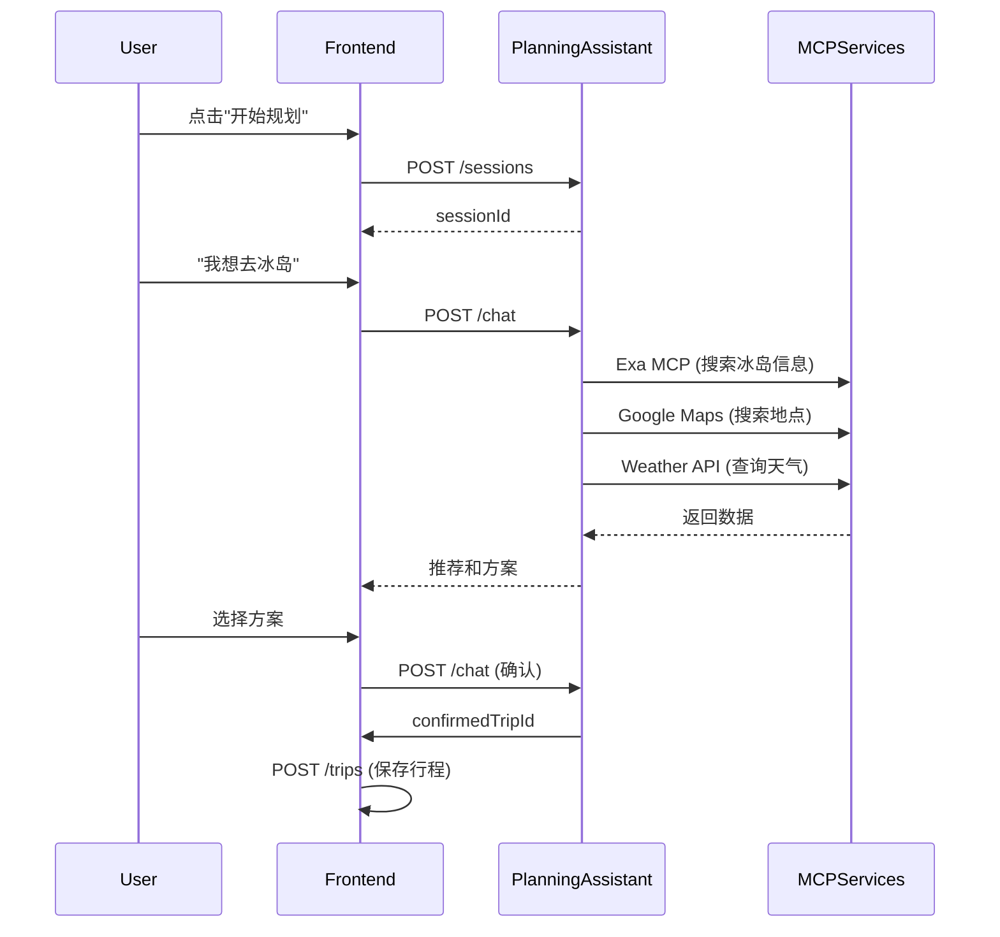
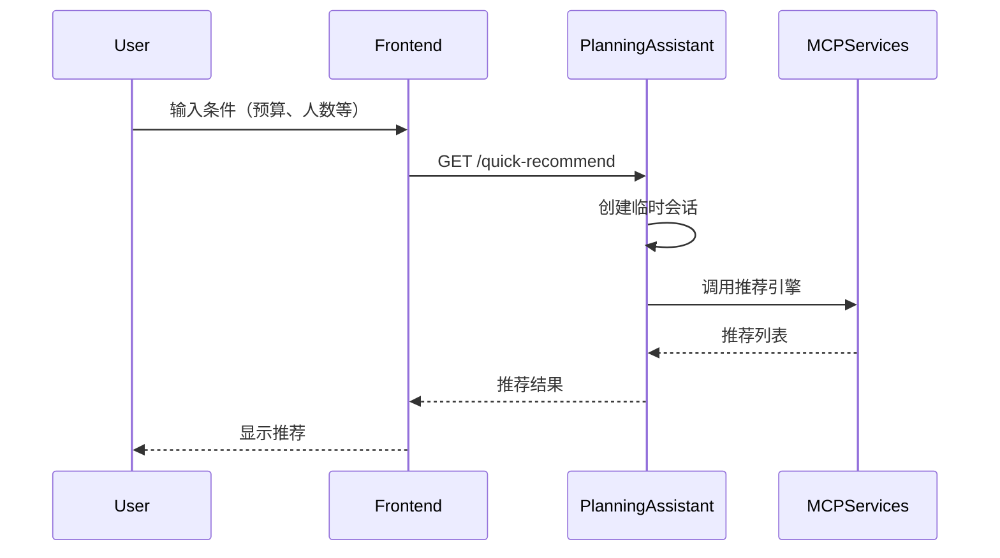
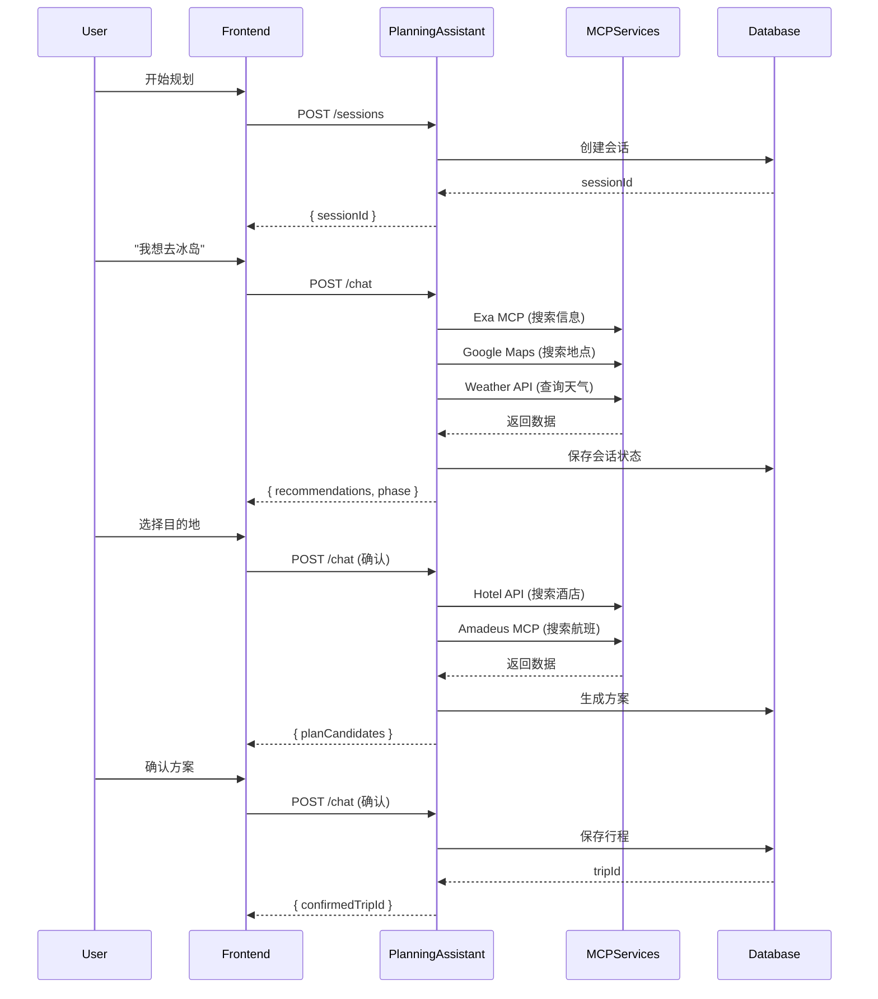

# 规划助手智能体 API 接口文档

**版本**: 2.0.0  
**最后更新**: 2026-02-08  
**基础路径**: `/api/agent/planning-assistant`

---

## 📋 目录

- [概述](#概述)
- [认证方式](#认证方式)
- [业务场景](#业务场景)
- [接口列表](#接口列表)
- [错误处理](#错误处理)
- [使用示例](#使用示例)
- [调用流程](#调用流程)
- [MCP 能力集成](#mcp-能力集成)
- [版本历史](#版本历史)

---

## 📖 概述

### 模块说明

规划助手智能体（Planning Assistant）是 TripNARA 的核心 AI 能力，帮助用户从零开始规划旅行。通过多轮对话，收集用户需求、推荐目的地、生成行程方案，并最终保存为完整行程。

### 核心能力

- ✅ **智能对话引导** - 多轮对话收集用户需求和偏好
- ✅ **目的地推荐** - 基于用户偏好推荐个性化目的地
- ✅ **行程方案生成** - 自动生成多套行程方案供用户选择
- ✅ **方案对比** - 对比不同方案的优缺点
- ✅ **偏好学习** - 学习用户偏好，提供个性化推荐
- ✅ **MCP 能力集成** - 集成 10+ MCP 服务，提供丰富能力

### 适用场景

- 🎯 **新用户规划**: 用户首次使用，从零开始规划旅行
- 🎯 **目的地探索**: 用户有大致方向，需要推荐具体目的地
- 🎯 **方案对比**: 用户需要对比不同行程方案
- 🎯 **偏好学习**: 系统学习用户偏好，提供个性化推荐

---

## 🔐 认证方式

### 认证类型

**公开接口** - 所有接口均为公开接口（`@Public()`），无需认证即可使用。

### 用户关联（可选）

虽然接口不需要认证，但建议传递 `userId` 参数以关联用户：

- **已登录用户**: 传递 `userId`，会话将与用户账户关联
- **匿名用户**: 不传递 `userId`，创建临时会话

---

## 🎯 业务场景

### 场景1: 新用户首次规划

**用户故事**: 作为新用户，我希望通过对话快速规划一次旅行，而不需要了解复杂的规划工具。

**用户旅程**:
1. 用户打开应用，点击"开始规划"
2. 系统创建会话，引导用户输入需求
3. 用户说"我想去冰岛旅行"
4. 系统推荐冰岛相关目的地和方案
5. 用户选择方案并确认
6. 系统保存行程

**涉及的接口**:
- `POST /api/agent/planning-assistant/sessions` - 创建会话
- `POST /api/agent/planning-assistant/chat` - 发送消息（多次）
- `GET /api/agent/planning-assistant/sessions/:sessionId` - 查询会话状态
- `POST /api/trips` - 保存行程（确认后）

**流程图**:



---

### 场景2: 快速推荐（无需会话）

**用户故事**: 作为用户，我希望快速获取目的地推荐，而不需要创建完整会话。

**用户旅程**:
1. 用户访问快速推荐页面
2. 输入简单条件（预算、人数、天数等）
3. 系统返回推荐列表
4. 用户查看推荐，可选择创建完整会话

**涉及的接口**:
- `GET /api/agent/planning-assistant/quick-recommend` - 快速推荐

**流程图**:



---

### 场景3: 用户偏好管理

**用户故事**: 作为用户，我希望系统记住我的偏好，以便下次规划时提供更个性化的推荐。

**用户旅程**:
1. 用户多次使用规划助手
2. 系统学习用户偏好（目的地、预算、旅行风格等）
3. 用户查看学习到的偏好
4. 用户可以选择清除偏好，重新开始

**涉及的接口**:
- `GET /api/agent/planning-assistant/users/:userId/preferences` - 获取偏好摘要
- `POST /api/agent/planning-assistant/users/:userId/preferences/clear` - 清除偏好

---

## 📡 接口列表

### 1. 创建新会话

**端点**: `POST /api/agent/planning-assistant/sessions`

**说明**: 创建一个新的旅行规划对话会话。会话用于管理规划过程中的状态、偏好和消息历史。

**认证**: 公开接口，无需认证

#### 请求参数

**请求体**:

```json
{
  "userId": "user_123456"  // 可选，用户ID
}
```

| 参数 | 类型 | 必填 | 说明 |
|------|------|------|------|
| userId | string | 否 | 用户ID。如果提供，会话将与用户关联；如果不提供，将创建匿名会话 |

#### 响应

**成功响应** (201):

```json
{
  "sessionId": "550e8400-e29b-41d4-a716-446655440000"
}
```

**错误响应** (400):

```json
{
  "success": false,
  "error": {
    "code": "VALIDATION_ERROR",
    "message": "参数验证失败",
    "details": {
      "userId": "userId 必须是字符串"
    }
  },
  "statusCode": 400
}
```

#### 示例请求

```bash
# 创建用户会话
curl -X POST "http://localhost:3000/api/agent/planning-assistant/sessions" \
  -H "Content-Type: application/json" \
  -d '{
    "userId": "user_123456"
  }'

# 创建匿名会话
curl -X POST "http://localhost:3000/api/agent/planning-assistant/sessions" \
  -H "Content-Type: application/json" \
  -d '{}'
```

---

### 2. 发送消息进行对话

**端点**: `POST /api/agent/planning-assistant/chat`

**说明**: 向规划助手发送消息，获取智能回复、推荐和行程方案。需要先创建会话获取 `sessionId`。

**认证**: 公开接口，无需认证

#### 请求参数

**请求体**:

```json
{
  "sessionId": "550e8400-e29b-41d4-a716-446655440000",
  "userId": "user_123456",
  "message": "我想去冰岛旅行，有什么推荐吗？",
  "language": "zh",
  "context": {
    "currentLocation": {
      "lat": 39.9042,
      "lng": 116.4074
    },
    "timezone": "Asia/Shanghai"
  }
}
```

| 参数 | 类型 | 必填 | 说明 |
|------|------|------|------|
| sessionId | string | 是 | 会话ID，通过创建会话接口获取 |
| userId | string | 否 | 用户ID |
| message | string | 是 | 用户发送的消息内容 |
| language | 'en' \| 'zh' | 否 | 语言偏好，默认为 'zh' |
| context | object | 否 | 请求上下文信息 |
| context.currentLocation | object | 否 | 当前位置信息 |
| context.currentLocation.lat | number | 否 | 纬度 |
| context.currentLocation.lng | number | 否 | 经度 |
| context.timezone | string | 否 | 时区 |

#### 响应

**成功响应** (200):

```json
{
  "message": "I'd be happy to help you plan a trip to Iceland!",
  "messageCN": "我很乐意帮您规划冰岛之旅！",
  "phase": "RECOMMENDING_DESTINATIONS",
  "recommendations": [
    {
      "id": "IS",
      "countryCode": "IS",
      "name": "Iceland",
      "nameCN": "冰岛",
      "description": "Land of fire and ice",
      "descriptionCN": "冰与火之地",
      "highlights": ["Northern Lights", "Geysers", "Glaciers"],
      "highlightsCN": ["极光", "间歇泉", "冰川"],
      "matchScore": 95,
      "matchReasons": ["Matches your interest in nature"],
      "matchReasonsCN": ["符合您对自然的兴趣"],
      "estimatedBudget": {
        "min": 15000,
        "max": 25000,
        "currency": "CNY"
      },
      "bestSeasons": ["summer", "winter"],
      "tags": ["nature", "adventure"]
    }
  ],
  "guidingQuestions": [
    {
      "question": "When would you like to travel?",
      "questionCN": "您想什么时候出行？",
      "type": "date"
    }
  ]
}
```

**错误响应** (400):

```json
{
  "success": false,
  "error": {
    "code": "VALIDATION_ERROR",
    "message": "参数验证失败",
    "details": {
      "sessionId": "sessionId 不能为空",
      "message": "message 必须是字符串"
    }
  },
  "statusCode": 400
}
```

**错误响应** (404):

```json
{
  "success": false,
  "error": {
    "code": "SESSION_NOT_FOUND",
    "message": "会话不存在或已过期",
    "details": {
      "sessionId": "550e8400-e29b-41d4-a716-446655440000"
    }
  },
  "statusCode": 404
}
```

#### 对话阶段说明

| 阶段 | 说明 |
|------|------|
| `INITIAL` | 初始阶段，收集基本信息 |
| `COLLECTING_PREFERENCES` | 收集用户偏好 |
| `RECOMMENDING_DESTINATIONS` | 推荐目的地 |
| `COMPARING_PLANS` | 对比方案 |
| `CONFIRMING` | 确认行程 |
| `COMPLETED` | 已完成 |

---

### 3. 获取会话状态

**端点**: `GET /api/agent/planning-assistant/sessions/:sessionId`

**说明**: 获取指定会话的当前状态，包括偏好、推荐和方案。

**认证**: 公开接口，无需认证

#### 请求参数

**路径参数**:

| 参数 | 类型 | 必填 | 说明 |
|------|------|------|------|
| sessionId | string | 是 | 会话ID |

#### 响应

**成功响应** (200):

```json
{
  "sessionId": "550e8400-e29b-41d4-a716-446655440000",
  "userId": "user_123456",
  "phase": "RECOMMENDING_DESTINATIONS",
  "preferences": {},
  "recommendations": [],
  "selectedDestination": null,
  "planCandidates": [],
  "selectedPlanId": null,
  "confirmedTripId": null,
  "messageCount": 5,
  "createdAt": "2026-02-08T10:00:00.000Z",
  "updatedAt": "2026-02-08T10:05:00.000Z"
}
```

---

### 4. 快速推荐（无需会话）

**端点**: `GET /api/agent/planning-assistant/quick-recommend`

**说明**: 无需创建会话，直接根据简单条件获取目的地推荐。

**认证**: 公开接口，无需认证

#### 请求参数

**查询参数**:

| 参数 | 类型 | 必填 | 说明 | 默认值 |
|------|------|------|------|--------|
| budget | string | 否 | 预算 | - |
| travelersCount | string | 否 | 出行人数 | - |
| preferredType | string | 否 | 偏好类型 | - |
| country_code | string | 否 | 国家代码 | - |
| duration_days | string | 否 | 行程天数 | - |
| travel_style | string | 否 | 旅行风格 | - |
| budget_level | string | 否 | 预算级别 | - |
| language | 'en' \| 'zh' | 否 | 语言 | 'zh' |

#### 响应

**成功响应** (200):

```json
{
  "sessionId": "550e8400-e29b-41d4-a716-446655440001",
  "recommendations": [
    {
      "id": "IS",
      "countryCode": "IS",
      "name": "Iceland",
      "nameCN": "冰岛"
    }
  ],
  "message": "推荐结果",
  "messageCN": "推荐结果"
}
```

---

### 5. 获取用户偏好摘要

**端点**: `GET /api/agent/planning-assistant/users/:userId/preferences`

**说明**: 获取系统学习到的用户旅行偏好，用于个性化推荐。

**认证**: 公开接口，无需认证

#### 请求参数

**路径参数**:

| 参数 | 类型 | 必填 | 说明 |
|------|------|------|------|
| userId | string | 是 | 用户ID |

#### 响应

**成功响应** (200):

```json
{
  "userId": "user_123456",
  "topPreferences": [
    {
      "category": "destination",
      "value": "冰岛",
      "confidence": 0.85,
      "count": 3
    },
    {
      "category": "travel_style",
      "value": "adventure",
      "confidence": 0.72,
      "count": 2
    }
  ],
  "summary": "您偏好自然风光和冒险旅行"
}
```

---

### 6. 清除用户偏好

**端点**: `POST /api/agent/planning-assistant/users/:userId/preferences/clear`

**说明**: 清除系统学习到的用户旅行偏好。

**认证**: 公开接口，无需认证

#### 请求参数

**路径参数**:

| 参数 | 类型 | 必填 | 说明 |
|------|------|------|------|
| userId | string | 是 | 用户ID |

#### 响应

**成功响应** (200):

```json
{
  "success": true
}
```

---

## ⚠️ 错误处理

### 错误响应格式

所有错误响应遵循统一格式，详见 [API 错误码定义](../../API_ERROR_CODES.md)。

### 常见错误码

| 错误码 | HTTP 状态码 | 说明 | 解决方案 |
|--------|------------|------|---------|
| `VALIDATION_ERROR` | 400 | 参数验证失败 | 检查请求参数 |
| `SESSION_NOT_FOUND` | 404 | 会话不存在或已过期 | 重新创建会话 |
| `SESSION_EXPIRED` | 400 | 会话已过期 | 重新创建会话 |
| `RATE_LIMIT_EXCEEDED` | 429 | 请求过于频繁 | 降低请求频率 |
| `PROVIDER_ERROR` | 503 | 外部服务不可用 | 稍后重试 |
| `INTERNAL_ERROR` | 500 | 服务器内部错误 | 稍后重试 |

### 错误处理最佳实践

1. **会话过期处理**: 
   - 检测到 `SESSION_NOT_FOUND` 或 `SESSION_EXPIRED` 错误时，自动重新创建会话

2. **重试策略**:
   - 5xx 错误：指数退避重试（最多3次）
   - 4xx 错误：不重试，检查请求参数

3. **降级策略**:
   - MCP 服务不可用时，返回缓存数据或默认值
   - 提供友好的错误提示

---

## 💡 使用示例

### JavaScript/TypeScript

```typescript
// 完整的规划流程示例
async function planTrip(userId: string, initialMessage: string) {
  try {
    // 1. 创建会话
    const sessionRes = await fetch('/api/agent/planning-assistant/sessions', {
      method: 'POST',
      headers: { 'Content-Type': 'application/json' },
      body: JSON.stringify({ userId }),
    });
    const { sessionId } = await sessionRes.json();

    // 2. 发送消息
    const chatRes = await fetch('/api/agent/planning-assistant/chat', {
      method: 'POST',
      headers: { 'Content-Type': 'application/json' },
      body: JSON.stringify({
        sessionId,
        userId,
        message: initialMessage,
        language: 'zh',
      }),
    });

    if (!chatRes.ok) {
      const error = await chatRes.json();
      throw new Error(error.error.message);
    }

    const response = await chatRes.json();
    return { sessionId, response };
  } catch (error) {
    console.error('规划失败:', error);
    throw error;
  }
}

// 使用示例
const { sessionId, response } = await planTrip(
  'user_123456',
  '我想去冰岛旅行'
);

console.log('会话ID:', sessionId);
console.log('回复:', response.messageCN);
if (response.recommendations) {
  console.log('推荐:', response.recommendations);
}
```

### React Hook 示例

```typescript
import { useState, useCallback } from 'react';

function usePlanningAssistant(userId?: string) {
  const [sessionId, setSessionId] = useState<string | null>(null);
  const [loading, setLoading] = useState(false);
  const [error, setError] = useState<any>(null);
  const [response, setResponse] = useState<any>(null);

  const createSession = useCallback(async () => {
    setLoading(true);
    setError(null);
    
    try {
      const res = await fetch('/api/agent/planning-assistant/sessions', {
        method: 'POST',
        headers: { 'Content-Type': 'application/json' },
        body: JSON.stringify({ userId }),
      });

      if (!res.ok) {
        const errorData = await res.json();
        throw new Error(errorData.error?.message || '创建会话失败');
      }

      const data = await res.json();
      setSessionId(data.sessionId);
      return data.sessionId;
    } catch (err: any) {
      setError(err);
      throw err;
    } finally {
      setLoading(false);
    }
  }, [userId]);

  const sendMessage = useCallback(async (message: string) => {
    if (!sessionId) {
      await createSession();
    }

    setLoading(true);
    setError(null);
    
    try {
      const res = await fetch('/api/agent/planning-assistant/chat', {
        method: 'POST',
        headers: { 'Content-Type': 'application/json' },
        body: JSON.stringify({
          sessionId: sessionId!,
          userId,
          message,
          language: 'zh',
        }),
      });

      if (!res.ok) {
        const errorData = await res.json();
        
        // 处理会话过期
        if (errorData.error?.code === 'SESSION_NOT_FOUND') {
          const newSessionId = await createSession();
          // 重试发送消息
          return sendMessage(message);
        }
        
        throw new Error(errorData.error?.message || '发送消息失败');
      }

      const data = await res.json();
      setResponse(data);
      return data;
    } catch (err: any) {
      setError(err);
      throw err;
    } finally {
      setLoading(false);
    }
  }, [sessionId, userId, createSession]);

  return {
    sessionId,
    loading,
    error,
    response,
    createSession,
    sendMessage,
  };
}
```

---

## 🔄 调用流程

### 完整规划流程



---

## 🔌 MCP 能力集成

规划助手集成了以下 MCP 服务，提供丰富的能力：

### P0 核心能力

| MCP 服务 | 能力 | 使用场景 |
|---------|------|---------|
| **Exa MCP** | Web搜索、目的地研究 | 搜索目的地信息、景点介绍 |
| **Google Maps Direct** | 地点搜索、地理编码 | 搜索地点、获取坐标 |
| **Hotel Direct API** | 酒店搜索、推荐 | 根据预算和位置搜索酒店 |
| **Weather Direct API** | 天气查询 | 查询目的地天气，影响活动推荐 |
| **Vision Service + OCR** | 图片识别地点、OCR提取文字 | 用户上传图片识别地点 |
| **Translation Direct API** | 翻译服务、图片翻译 | 翻译目的地信息 |

### P1 增强能力

| MCP 服务 | 能力 | 使用场景 |
|---------|------|---------|
| **Airbnb MCP** | 民宿搜索 | 搜索民宿，补充酒店选择 |
| **Amadeus MCP** | 航班搜索 | 搜索往返航班 |
| **Rail MCP** | 铁路查询 | 查询铁路路线和时刻表 |
| **Image Direct API** | 目的地图片 | 获取目的地图片，视觉参考 |
| **PostgreSQL MCP** | 用户数据查询 | 查询用户历史、偏好数据 |

### MCP 能力调用示例

```typescript
// 规划助手内部调用 MCP 服务
async function searchDestination(query: string) {
  // 调用 Exa MCP 搜索目的地信息
  const exaResult = await mcpClient.callTool('exa.web_search_exa', {
    query: `${query} 旅游攻略`,
    numResults: 10,
  });

  // 调用 Google Maps 搜索地点
  const placesResult = await mcpClient.callTool('google_maps.searchPlaces', {
    query,
  });

  // 调用 Weather API 查询天气
  const weatherResult = await mcpClient.callTool('weather.getCurrentWeather', {
    city: query,
  });

  return {
    information: exaResult,
    places: placesResult,
    weather: weatherResult,
  };
}
```

---

## 📚 版本历史

### v2.0.0 (2026-02-08)

- ✅ 使用标准文档模板
- ✅ 补充业务场景说明
- ✅ 添加调用流程图
- ✅ 统一错误处理格式
- ✅ 完善 MCP 能力集成说明

### v1.0.0 (2026-02-04)

- ✅ 初始版本
- ✅ 支持创建用户会话和匿名会话
- ✅ 会话TTL为24小时
- ✅ 添加对话接口文档

---

## 🔗 相关文档

- [API 错误码定义](../../API_ERROR_CODES.md)
- [API 文档模板](../../API_DOCUMENTATION_TEMPLATE.md)
- [产品经理接口梳理](../../API_PRODUCT_MANAGER_REVIEW.md)
- [MCP 能力管理 API](../../mcp/MCP_CAPABILITY_MANAGEMENT_API.md)
- [规划助手 MCP 能力配置](../AGENT_MCP_CAPABILITIES.md)
- [用户偏好接口文档](./user-preferences.md)

---

## 📞 支持

**技术支持**: 后端开发团队  
**文档反馈**: [GitHub Issues]  
**API 状态**: [状态页面]

---

**文档维护**: 产品经理团队  
**最后更新**: 2026-02-08  
**下次审查**: 2026-03-08
