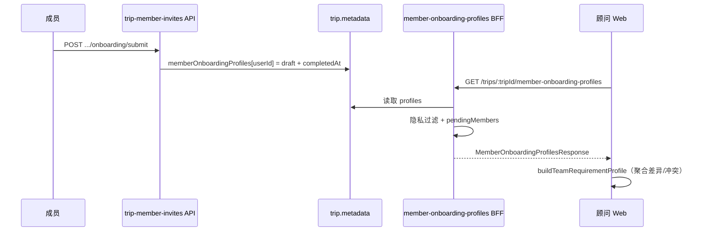

# 团队需求画像 BFF — 后端接口契约

**版本：** P1（**已上线**）  
**Base URL：** `/api`  
**更新：** 2026-07-10

---

## 实现索引

| 模块 | 文件 |
|------|------|
| 前端 API | `src/api/trip-member-onboarding-profiles.ts` |
| 类型 | `src/types/team-requirement-profile.ts` |
| 归一化 | `src/lib/normalize-team-requirement-profile.util.ts` |
| 聚合（前端） | `src/lib/team-requirement-profile.util.ts` |
| Hook | `src/hooks/useTeamRequirementProfile.ts` |
| UI | `src/features/member-onboarding/components/TeamRequirementProfilePanel.tsx` |
| 挂载 | `TripDetailMembersTab` · `CollabCenterMembersTab`（规划工作台） |
| 写入来源 | `POST /trips/member-invites/:code/onboarding/submit` → `trip.metadata.memberOnboardingProfiles[userId]` |

关联文档：`docs/api/member-onboarding-frontend-integration.md` §2（成员问卷写入）

---

## 1. 概述

### 1.1 目标

为顾问提供 **可用于规划的团队需求画像**，将成员 10 步 Onboarding 问卷整理为结构化数据，而非原始表单堆积。

BFF 职责：

1. 读取 `trip.metadata.memberOnboardingProfiles`
2. 对比行程协作者 / 已 accept 邀请，计算 **信息缺口**（`pendingMembers`）
3. 按 `privateNotesAuth` 做 **隐私过滤**（`advisorVisiblePrivateNotes`）
4. 仅返回 **已提交**（`completedAt` 非空）的完整画像；草稿不入 `profiles`

**不在此 BFF 内聚合的内容**（由前端或其他 BFF 组合）：

- 决策画像摩擦雷达（`GET friction-radar`）
- Gate1 参与者约束（`GET .../constraints`）
- 优化权重启发式偏好

### 1.2 与「决策风格画像」区分

| 名称 | 数据来源 | Tab |
|------|----------|-----|
| **团队需求画像**（本文档） | 成员 Onboarding 10 步问卷 | 行程成员 Tab / 协作中心成员 Tab |
| **决策风格画像** | Decision Profiling 问卷 | 协作中心「团队画像」Tab |

---

## 2. 接口

### 2.1 获取行程成员 Onboarding 画像

```
GET /api/trips/:tripId/member-onboarding-profiles
```

| 项 | 说明 |
|----|------|
| 鉴权 | `Authorization: Bearer <JWT>` |
| 权限 | 仅 **OWNER / ADVISOR / EDITOR**（复用 `ADVISOR_PATCH_ROLES`）；VIEWER → 403 |
| 缓存 | 建议 `Cache-Control: private, max-age=30`；submit 后应失效 |

#### 成功响应

`data` 顶层 **camelCase 与 snake_case 双写**（与后端实现一致）：

```typescript
{
  success: true,
  data: {
    tripId: string;
    trip_id: string;
    profiles: MemberOnboardingProfile[];
    pendingMembers: TeamRequirementPendingMember[];
    pending_members: TeamRequirementPendingMember[];
    generatedAt?: string;
    generated_at?: string;
  }
}
```

前端归一化后仅消费 camelCase 形态：

```typescript
interface MemberOnboardingProfilesResponse {
  tripId: string;
  /** 仅含 completedAt 非空的已提交画像 */
  profiles: MemberOnboardingProfile[];
  /** 已 accept 邀请但未 submit 的成员 */
  pendingMembers?: TeamRequirementPendingMember[];
  generatedAt?: string;
}
```

#### 错误响应

| HTTP | `error.code` | 说明 |
|------|--------------|------|
| 401 | `UNAUTHORIZED` | 未登录 |
| 403 | `FORBIDDEN` | 无行程读权限 |
| 404 | `TRIP_NOT_FOUND` | 行程不存在 |
| 404 | `NOT_FOUND` | 行程不存在，或 **BFF 路由未注册**（前端会降级读 `trip.metadata`） |

```typescript
{
  success: false,
  error: {
    code: string;
    message: string;
  }
}
```

---

## 3. 数据模型

### 3.1 MemberOnboardingProfile

在 `MemberOnboardingDraft`（`src/types/member-onboarding.ts`）基础上扩展：

```typescript
interface MemberOnboardingProfile extends MemberOnboardingDraft {
  userId: string;           // 必填，SSOT 键
  memberId?: string;        // tripCollaborator.id 或 team member id
  advisorVisiblePrivateNotes?: string | null;  // 见 §4 隐私规则
}
```

#### 问卷字段（与 submit 写入一致）

| 字段 | 类型 | 说明 |
|------|------|------|
| `inviteToken` | string | 成员邀请码 |
| `tripId` | string? | 行程 ID |
| `roleSlot` | TripMemberRoleSlot? | 邀请角色槽 |
| `displayName` | string | 显示名 |
| `tripRole` | MemberTripRole | 表单角色 |
| `guardianFor` | string? | 监护人关联 |
| `coreWishes` | string[3] | 核心愿望，最多 3 项 |
| `mustExperience` | string | 必体验 |
| `avoidExperience` | string | 需避开 |
| `pacePreference` | `'relaxed' \| 'moderate' \| 'active'` | 体力节奏 |
| `earlyRiser` | boolean | 是否可早起 |
| `maxDailyWalkKm` | number? | 日步行上限 km |
| `lodgingPreference` | string | 住宿偏好 |
| `dietRestrictions` | string | 饮食限制 |
| `healthNotes` | string | 健康备注 |
| `personalSpendingLevel` | `'budget' \| 'moderate' \| 'premium'` | 个人消费档位 |
| `personalSpendingNotes` | string | 消费备注 |
| `acceptSplitGroup` | `'yes' \| 'no' \| 'depends'` | 分流态度 |
| `splitGroupNotes` | string | 分流备注 |
| `privateNotes` | string | **禁止**在响应中返回原文（见 §4） |
| `privateNotesAuth` | `'ANALYST_ONLY' \| 'SANITIZED_TO_ADVISOR'` | 私密授权级别 |
| `currentStepId` | MemberOnboardingStepId? | 最近步骤（已提交可省略） |
| `completedAt` | string? | 提交时间；**profiles 内必填** |
| `updatedAt` | string? | 最后更新时间 |

### 3.2 TeamRequirementPendingMember

```typescript
type TeamRequirementInfoGapReason =
  | 'onboarding_not_started'   // 无 draft 记录
  | 'onboarding_in_progress'   // 有 draft 且已有实质填写或 currentStepId
  | 'onboarding_not_submitted'; // 已填 displayName 但未 submit

interface TeamRequirementPendingMember {
  userId: string;
  displayName: string;
  role?: string;
  reason: TeamRequirementInfoGapReason;
}
```

#### `pendingMembers` 计算规则（后端 SSOT · 已实现）

1. **候选人集合**：已 `accept` 邀请、尚未 `submit` 的 `trip_member_invites` 绑定成员
2. 若 `userId` 不在 `memberOnboardingProfiles` 或对应 profile **`completedAt` 为空** → 进入 `pendingMembers`
3. `reason` 判定（与后端一致）：
   - 无 onboarding draft 记录 → `onboarding_not_started`
   - 有 draft 且已有实质填写或存在 `currentStepId` → `onboarding_in_progress`
   - 已填 `displayName` 但未 submit → `onboarding_not_submitted`
4. **勿**将已 submit 的 `userId` 重复放入 `pendingMembers`

### 3.3 profiles 筛选规则

- 仅包含 `trip.metadata.memberOnboardingProfiles[userId]` 且 **`completedAt` 非空** 的条目
- 按 `completedAt` 降序或 `displayName` 升序（实现自定，前端不依赖顺序）
- 响应 **不得** 使用 `Record<userId, profile>` 作为唯一形态；推荐 `profiles: []`，前端归一化层兼容两种格式

---

## 4. 隐私与脱敏

### 4.1 响应中禁止返回的字段

| 字段 | 规则 |
|------|------|
| `privateNotes` | **永远不返回原文** |

### 4.2 advisorVisiblePrivateNotes

| privateNotesAuth | 行为 |
|------------------|------|
| `ANALYST_ONLY` | `advisorVisiblePrivateNotes = null`；前端据 `privateNotesAuth` 显示「仅分析师可见」 |
| `SANITIZED_TO_ADVISOR` | 返回 `advisorVisiblePrivateNotes`：**邮箱/电话脱敏 + 200 字截断** |

脱敏示例：

```
原文：「不想和婆婆同住一间，希望有二人独处时间」
脱敏：「希望安排半天二人独处时间」
```

### 4.3 请求者角色（可选增强）

| 调用者 | 建议 |
|--------|------|
| 顾问 / EDITOR / OWNER | 返回 `advisorVisiblePrivateNotes`（按上表） |
| 分析师 / 内部角色 | 可扩展 `?audience=analyst` 返回完整私密（**非 P1**） |

P1 仅需满足顾问读路径。

---

## 5. 数据来源与写入链路



持久化路径（与 submit 一致）：

```
trip.metadata.memberOnboardingProfiles: Record<userId, MemberOnboardingDraft & { completedAt }>
```

---

## 6. 响应示例

### 6.1 正常：部分成员已提交

```json
{
  "success": true,
  "data": {
    "tripId": "trip_abc123",
    "generatedAt": "2026-07-10T06:00:00.000Z",
    "profiles": [
      {
        "userId": "user_001",
        "memberId": "collab_001",
        "inviteToken": "INV8K2M",
        "tripId": "trip_abc123",
        "roleSlot": "MEMBER",
        "displayName": "张明",
        "tripRole": "MEMBER",
        "coreWishes": ["看极光", "泡温泉", ""],
        "mustExperience": "至少一晚特色住宿",
        "avoidExperience": "高强度徒步",
        "pacePreference": "relaxed",
        "earlyRiser": false,
        "maxDailyWalkKm": 5,
        "lodgingPreference": "安静、双床房",
        "dietRestrictions": "不吃生食",
        "healthNotes": "膝盖旧伤",
        "personalSpendingLevel": "moderate",
        "personalSpendingNotes": "住宿可适度升级",
        "acceptSplitGroup": "depends",
        "splitGroupNotes": "若孩子太累可分开活动",
        "privateNotesAuth": "SANITIZED_TO_ADVISOR",
        "advisorVisiblePrivateNotes": "希望安排半天二人独处时间",
        "completedAt": "2026-07-09T12:30:00.000Z",
        "updatedAt": "2026-07-09T12:30:00.000Z"
      }
    ],
    "pendingMembers": [
      {
        "userId": "user_002",
        "displayName": "王磊",
        "role": "MEMBER",
        "reason": "onboarding_in_progress"
      }
    ]
  }
}
```

注意：示例中 **无** `privateNotes` 字段。

### 6.2 空态：无人提交

```json
{
  "success": true,
  "data": {
    "tripId": "trip_abc123",
    "profiles": [],
    "pendingMembers": [
      {
        "userId": "user_001",
        "displayName": "张明",
        "role": "PAYER",
        "reason": "onboarding_not_started"
      }
    ],
    "generatedAt": "2026-07-10T06:00:00.000Z"
  }
}
```

---

## 7. 字段命名

前后端兼容 **camelCase** 与 **snake_case**。前端归一化见 `normalize-team-requirement-profile.util.ts`。

| camelCase | snake_case |
|-----------|------------|
| `tripId` | `trip_id` |
| `userId` | `user_id` |
| `memberId` | `member_id` |
| `coreWishes` | `core_wishes` |
| `mustExperience` | `must_experience` |
| `avoidExperience` | `avoid_experience` |
| `pacePreference` | `pace_preference` |
| `earlyRiser` | `early_riser` |
| `maxDailyWalkKm` | `max_daily_walk_km` |
| `lodgingPreference` | `lodging_preference` |
| `dietRestrictions` | `diet_restrictions` |
| `healthNotes` | `health_notes` |
| `personalSpendingLevel` | `personal_spending_level` |
| `personalSpendingNotes` | `personal_spending_notes` |
| `acceptSplitGroup` | `accept_split_group` |
| `splitGroupNotes` | `split_group_notes` |
| `privateNotesAuth` | `private_notes_auth` |
| `advisorVisiblePrivateNotes` | `advisor_visible_private_notes` |
| `completedAt` | `completed_at` |
| `updatedAt` | `updated_at` |
| `pendingMembers` | `pending_members` |
| `generatedAt` | `generated_at` |
| `memberOnboardingProfiles` | `member_onboarding_profiles`（仅作 profiles 别名兼容） |

---

## 8. 前端聚合（非 BFF 职责）

BFF 返回 **逐人原始画像 + 缺口列表**；以下由前端 `buildTeamRequirementProfile()` 计算：

| 展示块 | 来源 |
|--------|------|
| 完成率 | `submittedCount / expectedCount` |
| 体力/消费/分流差异 | profiles 字段横向对比 |
| 潜在冲突（问卷） | 节奏、分流、消费、必体验/避开文本冲突 |
| 潜在冲突（摩擦） | `GET friction-radar` 的 `highRiskAlerts` |
| 信息缺口展示文案 | `pendingMembers.reason` → 中文标签 |
| 私密统计 | `privateNotesAuth` + `advisorVisiblePrivateNotes` |

若未来需减轻前端计算，可扩展：

```
GET /api/trips/:tripId/member-onboarding-profiles/summary
```

**非 P1**；P1 仅实现 §2.1。

---

## 9. 可选扩展：并入 collab-overview

与 `GET /trips/:tripId/collab-overview` 对齐时，可在 `CollabOverviewResponse` 增加：

```typescript
interface CollabOverviewResponse {
  // ...existing
  memberOnboardingProfiles?: MemberOnboardingProfilesResponse;
  onboardingCompletionRate?: number; // 0–100
}
```

前端当前 **独立请求** `member-onboarding-profiles`；并入后需同步更新 `src/types/collab-overview.ts` 与 `tripCollabApi`。

---

## 10. 验收清单

- [x] OWNER/ADVISOR/EDITOR 可读取（`ADVISOR_PATCH_ROLES`）；无关用户 403
- [x] `profiles` 仅含 `completedAt` 非空记录
- [x] 响应不含 `privateNotes` / `private_notes` 原文
- [x] `SANITIZED_TO_ADVISOR` 返回脱敏 `advisorVisiblePrivateNotes`；`ANALYST_ONLY` 为 null
- [x] `pendingMembers` 覆盖已 accept 未 submit 成员，reason 三分法
- [x] 顶层 camelCase + snake_case 双写
- [x] 前端归一化 + 隐私推断（`normalize-team-requirement-profile.util.ts`）
- [x] **无 mock 降级**；接口失败时展示错误，不注入示例人名

---

## 11. 变更记录

| 日期 | 版本 | 说明 |
|------|------|------|
| 2026-07-10 | P1 | 后端上线；前端对齐隐私推断与双写归一化 |
| 2026-07-10 | P1 | 初版契约 + 前端面板对接 |
