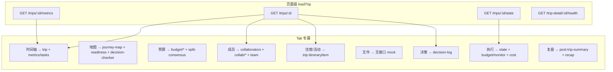

# 行程详情页 · Tab 后端接口契约

> **版本**: 1.0.0  
> **Base**: `/api`（`apiClient` 默认前缀）  
> **状态**: 前端已实现 Tab 结构 · 部分 Tab 仍为 mock / 前端推导  
> **关联 UI**: `src/pages/trips/[id].tsx`、`src/components/trips/detail/tabs/*`  
> **关联文档**: [trip-detail-tab-frontend-integration.md](./trip-detail-tab-frontend-integration.md)（Tab BFF 前端集成）、[trip-detail-enhancement.md](./trip-detail-enhancement.md)（健康度扩展等规划向接口）、[trip-list-api.md](./trip-list-api.md)（行程列表页接口）、[journey-map-bff-api.md](./journey-map-bff-api.md)、[trip-decision-profiling-api.md](./trip-decision-profiling-api.md)、[team-tab-backend-requirements.md](./team-tab-backend-requirements.md)

**最后更新**: 2026-07-02

---

## 1. Tab 一览

| Tab | `value` | 显示条件 | 组件 |
|-----|---------|----------|------|
| 时间轴 | `timeline` | 固定，**默认 Tab** | `TripDetailTimelineTab` |
| 地图 | `map` | 固定 | `TripDetailMapTab` |
| 预算 | `budget` | 固定 | `TripDetailBudgetTab` |
| 成员 | `members` | 固定 | `TripDetailMembersTab` |
| 住宿 | `accommodation` | 固定 | `TripDetailAccommodationTab` |
| 活动 | `activities` | 固定 | `TripDetailActivitiesTab` |
| 文件 | `files` | 固定 | `TripDetailFilesTab` |
| 决策记录 | `decision-log` | 固定 | `TripDetailDecisionLogTab` |
| 执行 | `execute` | `status ∈ { IN_PROGRESS, COMPLETED }` | `[id].tsx` 内联 |
| 复盘 | `insights` | `status === COMPLETED` | `[id].tsx` 内联 |

导航定义：`src/components/trips/detail/TripDetailTabNav.tsx`；条件 Tab 在 `[id].tsx` 的 `extraTabs` 中注入。

---

## 2. 页面级公共接口

进入详情页时 `loadTrip()` 拉取，Header 与多个 Tab 共享。

| 优先级 | 方法 | 路径 | 前端调用 | 用途 |
|--------|------|------|----------|------|
| **P0** | GET | `/trips/:id` | `tripsApi.getById` | 行程主体：`TripDay`、`ItineraryItem`、`Place`、`statistics`、`metadata` |
| **P0** | GET | `/trips/:id/metrics` | `tripsApi.getMetrics` | 每日指标 → `dayMetricsMap`（时间轴 Tab 传入，部分 UI 未消费） |
| P1 | GET | `/trips/:id/state` | `tripsApi.getState` | 执行 Tab「下一步」、`nextStop` |
| P1 | GET | `/trip-detail/:id/health` | `tripDetailApi.getHealth` | 健康度（页面级；时间轴「可行性」可对接） |
| P1 | GET | `/trips/:id/budget/constraint` | `tripsApi.getBudgetConstraint` | 货币 / 预算约束 |
| P1 | GET | `/trips/:id/conflicts` | `tripsApi.getConflicts` | 冲突列表（全局 Banner / 提醒） |
| P1 | GET | `/trips/:id/suggestions` | `tripsApi.getSuggestions` | 优化建议（`status=new/seen`） |
| P1 | GET | `/trips/:id/persona-alerts` | `tripsApi.getPersonaAlerts` | 三人格提醒 |
| P2 | GET | `/countries` | `countriesApi.getAll` | 目的地国家列表 |
| P2 | GET | `/countries/currency-strategy` | `countriesApi.getCurrencyStrategy` | 目的地货币策略 |

**Header**（`TripDetailHeader`）仅消费 `GET /trips/:id` 返回的 `TripDetail`，不单独请求接口。

---

## 3. 各 Tab 接口明细

### 3.1 时间轴 `timeline`

**组件**: `TripDetailTimelineTab.tsx`  
**Props**: `trip`、`dayMetricsMap`（来自页面级 `getMetrics`）

#### 已对接

| 优先级 | 方法 | 路径 | 前端调用 | 说明 |
|--------|------|------|----------|------|
| **P0** | GET | `/trips/:id` | `tripsApi.getById` | 每日行程项、住宿、里程/时长 |
| **P0** | GET | `/trips/:tripId/timeline-overview` | `tripTimelineApi.getOverview` | 顶部统计 + 侧栏待办/提醒 BFF |
| P1 | GET | `/trips/:id/metrics` | `tripsApi.getMetrics` | 页面级仍加载；时间轴 Tab 优先用 BFF |

**契约**: [trip-timeline-overview-api.md](./trip-timeline-overview-api.md)

#### 前端实现

- `TripDetailTimelineTab` 挂载时请求 `timeline-overview`
- 替换原 mock：规划进度 62%、可行性 76、待确认 3、侧栏提醒/待办

#### 关键响应字段（`/trips/:id`）

```typescript
TripDetail {
  TripDay[] {
    id, date, theme
    ItineraryItem[] {
      id, type, startTime, endTime, note
      bookingStatus, placeId, Place?
      travelFromPreviousDistance?, travelFromPreviousDuration?
    }
  }
}
```

---

### 3.2 地图 `map`

**组件**: `TripDetailMapTab.tsx` → `useJourneyMapData`  
**全屏跳转**: `/dashboard/journey-map?tripId=:id`

#### 已对接

| 优先级 | 方法 | 路径 | 前端调用 | 说明 |
|--------|------|------|----------|------|
| **P0** | GET | `/trips/:tripId/journey-map` | `journeyMapApi.get` | 地图 BFF 主读模型（`fields=minimal`，支持 ETag/304） |
| **P0** | GET | `/trips/:id` | `tripsApi.getById` | fallback 补全行程基础数据 |

#### 增强依赖

| 优先级 | 方法 | 路径 | 前端调用 | 说明 |
|--------|------|------|----------|------|
| P1 | GET | `/readiness/trip/:tripId/coverage-map` | `readinessApi.getCoverageMapData` | 覆盖地图 |
| P1 | GET | `/readiness/trip/:tripId/score` | `readinessApi.getScoreBreakdown` | 准备度分数分解 |
| P1 | GET | `/trips/:tripId/decision-checker` | `decisionCheckerApi.get` | 决策校验 |
| P1 | GET | `/trips/:id/collaborators` | `tripsApi.getCollaborators` | 成员图层 |
| P1 | GET | `/itinerary-items/trip/:tripId` | `itineraryItemsApi.getByTrip` | 行程项详情补全 |
| P1 | GET | `/itinerary-items?tripDayId=` | `itineraryItemsApi.getAll` | 按日补全 |
| P2 | GET | `/trips/:tripId/journey-map/inspector/activities/:activityId` | `journeyMapApi.getInspectorActivity` | Inspector 详情（全屏地图） |

**详细契约**: [journey-map-bff-api.md](./journey-map-bff-api.md)、[planning-workbench-decision-checker-api.md](./planning-workbench-decision-checker-api.md)

---

### 3.3 预算 `budget`

**组件**: `TripDetailBudgetTab.tsx`  
**跳转**: 规划工作台预算 Tab

#### 已对接

| 优先级 | 方法 | 路径 | 前端调用 | 说明 |
|--------|------|------|----------|------|
| **P0** | GET | `/trips/:id/budget/summary` | `tripsApi.getBudgetSummary` | 总预算 / 已花 / 剩余 / 分类 |
| **P0** | GET | `/trips/:id/budget/constraint` | `tripsApi.getBudgetConstraint` | 约束与货币 |
| P1 | GET | `/trips/:id/budget/trends` | `tripsApi.getBudgetTrends` | 日趋势图 |
| P1 | GET | `/trips/:id/budget/statistics` | `tripsApi.getBudgetStatistics` | 执行统计、健康标签 |
| P1 | GET | `/trips/:id/budget/optimization` | `tripsApi.getBudgetOptimization` | 优化建议 |
| P1 | GET | `/trips/:id` | `tripsApi.getById` | 预订状态、成员数等衍生指标 |
| P1 | GET | `/trips/:tripId/decision-profiling/split-consensus` | `decisionProfilingApi.getSplitConsensus` | 多人分账共识（≥2 人） |

#### 写操作（交互，非首屏必读）

| 方法 | 路径 | 说明 |
|------|------|------|
| POST | `/trips/:id/budget/constraint` | 设置预算约束 |
| POST | `/trips/:tripId/decision-profiling/split-consensus/simulate` | 模拟分账 |
| POST | `/trips/:tripId/decision-profiling/split-consensus/select` | 选择分账方案 |
| POST | `/trips/:tripId/decision-profiling/split-consensus/confirm` | 确认分账 |

**关联**: [budget-tab-frontend-integration.md](./budget-tab-frontend-integration.md)、[trip-decision-profiling-api.md](./trip-decision-profiling-api.md)

---

### 3.4 成员 `members`

**组件**: `TripDetailMembersTab.tsx` + `tripCollabApi.getOverview`

#### 已对接

| 优先级 | 方法 | 路径 | 前端调用 | 说明 |
|--------|------|------|----------|------|
| **P0** | GET | `/trips/:id` | `tripsApi.getById` | 行程基础信息、旅行者人数 |
| **P0** | GET | `/trips/:tripId/collab-overview` | `tripCollabApi.getOverview` | 成员 Tab BFF：协作者、协作任务、teamHealth、画像/投票/心愿摘要 |
| P1 | GET | `/v2/user/team/:teamId` | `teamApi.get` | Optimization V2 团队成员与偏好（二段加载，`collab.team.fetchPath`） |

#### BFF 聚合源（`GET /trips/:tripId/collab-overview`）

| 原路径 | BFF 字段 |
|--------|----------|
| `GET /trips/:id/collaborators` | `collaborators` |
| `GET /trips/:tripId/collaborative-tasks` | `collaborativeTasks` |
| `GET /trips/:tripId/domain-influence` | `domainInfluence` |
| `GET /trips/:tripId/silent-votes` | `silentVotes` |
| `GET /trips/:tripId/decision-profiling/onboarding` | `profilingOnboarding` |
| `GET /trips/:tripId/decision-profiling/friction-radar` | `frictionRadar` |
| `GET /trips/:tripId/wishes/summary` | `wishSummary` |
| 团队 ID | `teamId` / `team.fetchPath` |

#### 协作中心（仍用 `useCollabOverview`）

团队协作中心页面仍并行调用原接口；仅行程详情成员 Tab 走 BFF。

| 优先级 | 方法 | 路径 | 前端调用 | 说明 |
|--------|------|------|----------|------|
| P1 | GET | `/trips/:tripId/collaborative-tasks` | `collaborativeTasksApi.list` | 协作中心任务 Tab |
| P1 | GET | `/trips/:tripId/silent-votes` | `silentVotesApi.list` | 协作中心决策 Tab |
| P1 | GET | `/trips/:tripId/decision-profiling/friction-radar` | `decisionProfilingApi.getFrictionRadar` | 共识维度 widget |
| P2 | GET | `/trips/:tripId/decision-profiling/team/travel-style` | — | 团队旅行风格 |
| P2 | GET | `/trips/:tripId/decision-profiling/team/money-dna` | — | 团队 Money DNA |

**关联**: [trip-collab-overview-api.md](./trip-collab-overview-api.md)、[team-tab-backend-requirements.md](./team-tab-backend-requirements.md)

---

### 3.5 住宿 `accommodation`

**组件**: `TripDetailAccommodationTab.tsx`  
**契约**: [trip-accommodation-overview-api.md](./trip-accommodation-overview-api.md)  
**API 客户端**: `tripAccommodationApi`（`src/api/trip-detail-tab-client.ts`）

#### 已对接

| 优先级 | 方法 | 路径 | 前端调用 | 说明 |
|--------|------|------|----------|------|
| **P0** | GET | `/trips/:tripId/accommodation-overview` | `tripAccommodationApi.loadTabData` | stats + nights + reminders + travel + files |
| **P0** | GET | `/trips/:id` | `tripsApi.getById` | 降级推导 / 旅行者人数 |

首屏：`loadTabData(tripId)`；失败时 `adaptAccommodationFromTrip(trip)`。

#### 编辑 / 写操作

| 场景 | API |
|------|-----|
| 规划工作台编辑 | `/dashboard/plan-studio?tripId=` |
| 上传预订资料 | `tripFilesApi.upload` + `itineraryItemId` |

---

### 3.6 活动 `activities`

**组件**: `TripDetailActivitiesTab.tsx`  
**契约**: [activity-favorites-api.md](./activity-favorites-api.md)

#### 已对接

| 优先级 | 方法 | 路径 | 前端调用 | 说明 |
|--------|------|------|----------|------|
| **P0** | GET | `/trips/:id` | `tripsApi.getById` | 活动类 `ItineraryItem` |
| P1 | GET | `/trips/:tripId/activity-favorites` | `tripActivityFavoritesApi.list` | 当前用户收藏 ID 列表 |
| P1 | POST | `/trips/:tripId/activity-favorites` | `tripActivityFavoritesApi.toggle` | 收藏/取消（行程项或 POI） |

#### 前端缺口

| 缺口 | 说明 |
|------|------|
| 活动封面图 | `Place.metadata` 图片字段缺失时为占位 |
| POI 详情 | 无独立扩展读模型 |

#### 建议增强

| 优先级 | 方法 | 路径 | 说明 |
|--------|------|------|------|
| P1 | — | 扩展 `Place` / item | 封面、评分、标签 |
| P2 | GET | `/itinerary-items/:id` | 单项详情（预订链接、开放时间） |

---

### 3.7 文件 `files`

**组件**: `TripDetailFilesTab.tsx`  
**契约**: [trip-files-api.md](./trip-files-api.md)  
**API 客户端**: `src/api/trip-detail-tab-client.ts`（`tripFilesApi`）

#### 已对接（P0 + P1）

| 优先级 | 方法 | 路径 | 前端调用 | 说明 |
|--------|------|------|----------|------|
| **P0** | GET | `/trips/:tripId/files/overview` | `tripFilesApi.getOverview` / `loadTabData` | 聚合读模型（trip_files + itinerary） |
| **P0** | GET | `/trips/:tripId/files` | `tripFilesApi.getList` | 文件列表（降级 / 分类筛选） |
| **P0** | GET | `/trips/:tripId/files/stats` | `tripFilesApi.getStats` | 统计与空间 |
| P1 | POST | `/trips/:tripId/files` | `tripFilesApi.upload` | multipart 上传 |
| P1 | POST | `/trips/:tripId/files/pending` | `tripFilesApi.createPending` | 待补充占位 |
| P1 | DELETE | `/trips/:tripId/files/:fileId` | `tripFilesApi.delete` | 删除（仅 `source=trip_file`） |
| P2 | GET | `/trips/:tripId/files/:fileId/download` | `tripFilesApi.getDownloadUrl` | 下载签名 URL |

首屏：`loadTabData` → 优先 `GET /files/overview`；不可用时降级 `stats` + `list`。

---

### 3.8 决策记录 `decision-log`

**组件**: `TripDetailDecisionLogTab.tsx`

#### 已对接

| 优先级 | 方法 | 路径 | 前端调用 | 说明 |
|--------|------|------|----------|------|
| **P0** | GET | `/trips/:id/decision-log?limit=&offset=` | `tripsApi.getDecisionLog` | 决策透明日志 |

#### Query

| 参数 | 说明 | 前端默认 |
|------|------|----------|
| `limit` | 条数 | `50` |
| `offset` | 偏移 | `0` |

#### 关键响应字段

```typescript
DecisionLogResponse {
  items: DecisionLogEntry[] {
    id, persona, action, timestamp
    evidenceRefs?, metadata?
    // ontology / readiness 扩展由前端 normalize 展示
  }
  total?: number
}
```

---

### 3.9 执行 `execute`（条件 Tab）

**组件**: `[id].tsx` 内联 + `BudgetMonitorCard` / `TripCostSummaryCard` / `UnpaidItemsList`  
**显示条件**: `trip.status ∈ { IN_PROGRESS, COMPLETED }`

#### 已对接

| 优先级 | 方法 | 路径 | 前端调用 | 说明 |
|--------|------|------|----------|------|
| **P0** | GET | `/trips/:id/state` | `tripsApi.getState` | 当前状态、`nextStop` |
| **P0** | GET | `/trips/:id/budget/monitor?realtime=true` | `tripsApi.getBudgetMonitor` | 实时预算监控（5s 轮询） |
| P1 | GET | `/itinerary-items/trip/:tripId/cost-summary` | `itineraryItemsApi.getCostSummary` | 费用汇总卡片 |
| P1 | GET | `/itinerary-items/trip/:tripId/unpaid` | `itineraryItemsApi.getUnpaidItems` | 未支付项列表 |
| P2 | GET | `/trips/:id/schedule?date=` | `tripsApi.getSchedule` | 今日时间线（完整执行页） |

**关联**: [in-trip-execution-m7-api.md](./in-trip-execution-m7-api.md)、[in-trip-money-m9-api.md](./in-trip-money-m9-api.md)

---

### 3.10 复盘 `insights`（条件 Tab）

**组件**: `[id].tsx` 内联 + `InTripPostTripSummaryPanel`  
**显示条件**: `trip.status === COMPLETED`

#### 已对接

| 优先级 | 方法 | 路径 | 前端调用 | 说明 |
|--------|------|------|----------|------|
| **P0** | GET | `/trips/:id/in-trip/experience/post-trip-summary` | `inTripExperienceApi.getPostTripSummary` | 行后总结面板 |
| P1 | GET | `/trips/:id/recap` | `tripsApi.getRecap` | 复盘报告（用户点击「生成报告」） |
| P2 | GET | `/trips/:id/recap/export` | `tripsApi.exportRecap` | 导出分享 |
| P2 | GET | `/trips/:id/trail-video-data` | `tripsApi.getTrailVideoData` | 3D 轨迹视频 |

**关联**: [in-trip-experience-m11-api.md](./in-trip-experience-m11-api.md)

---

## 4. P0 接口速查（后端必须可用）

以下为各 Tab **首屏渲染**最低依赖集合：

```
GET  /trips/:id                                          # 全 Tab 基础
GET  /trips/:tripId/timeline-overview                    # 时间轴 Tab
GET  /trips/:id/metrics                                  # 页面级
GET  /trips/:tripId/journey-map                          # 地图
GET  /trips/:id/budget/summary                           # 预算
GET  /trips/:id/budget/constraint                        # 预算 + 页面级
GET  /trips/:tripId/accommodation-overview               # 住宿 Tab
GET  /trips/:tripId/activity-favorites                   # 活动 Tab（收藏）
GET  /trips/:id/collaborators                            # 成员 + 地图
GET  /trips/:id/decision-log                             # 决策记录
GET  /trips/:id/state                                    # 执行（条件 Tab）
GET  /trips/:id/budget/monitor                           # 执行（条件 Tab）
GET  /trips/:tripId/files/overview                       # 文件 Tab（首屏）
GET  /trips/:tripId/files/stats                          # 文件 Tab
GET  /trips/:tripId/files                                # 文件 Tab
GET  /trips/:id/in-trip/experience/post-trip-summary     # 复盘（条件 Tab）
```

---

## 5. P0 缺口汇总（需新建或扩展）

| Tab | 缺口 | 建议 |
|-----|------|------|
| **文件** | ~~整套读/写接口缺失~~ | ✅ 已对接 `trip-files` API；待 migration 部署 |
| **时间轴** | ~~规划进度 / 待办 mock~~ | ✅ 已对接 `timeline-overview` BFF |
| **活动** | 封面图 | 收藏已对接 `activity-favorites`；封面仍依赖 `Place.metadata` |
| **住宿** | — | `GET /trips/:id/accommodation-overview` BFF 已对接 |
| **成员** | — | `GET /trips/:id/collab-overview` BFF 已对接 |

---

## 6. 依赖关系



---

## 7. 前端代码索引

| 路径 | 说明 |
|------|------|
| `src/pages/trips/[id].tsx` | 详情页主入口、`loadTrip`、条件 Tab |
| `src/components/trips/detail/TripDetailTabNav.tsx` | Tab 导航 |
| `src/components/trips/detail/tabs/*` | 各 Tab 组件 |
| `src/api/trips.ts` | 行程 / 预算 / metrics / decision-log 等 |
| `src/api/journey-map.ts` | 地图 BFF |
| `src/api/trip-detail.ts` | 健康度 |
| `src/api/collaborative-tasks.ts` | 协作任务 |
| `src/api/trip-decision-profiling.ts` | 决策画像 / 分账共识 |
| `src/api/in-trip-experience.ts` | 行后总结 |
| `src/api/trip-detail-tab-client.ts` | Tab BFF 统一 client（files / timeline / collab） |
| `src/api/trip-detail-tab.types.ts` | Tab BFF 类型聚合 |
| `src/api/trip-timeline.ts` | → re-export `tripTimelineApi` |
| `src/api/trip-files.ts` | → re-export `tripFilesApi` |
| `src/api/trip-collab.ts` | → re-export `tripCollabApi` |
| `src/api/trip-accommodation.ts` | → re-export `tripAccommodationApi` |
| `src/api/trip-activity-favorites.ts` | → re-export `tripActivityFavoritesApi` |
| `src/lib/accommodation-overview.util.ts` | 住宿 BFF → UI 映射 |
| `src/lib/trip-accommodation.util.ts` | 住宿 Tab 推导逻辑（BFF 降级） |
| `src/lib/trip-detail-budget.util.ts` | 预算 Tab 推导逻辑 |
| `src/lib/trip-detail-members.util.ts` | 成员 Tab 推导逻辑 |

---

## 8. 变更记录

| 版本 | 日期 | 说明 |
|------|------|------|
| 1.0.0 | 2026-07-02 | 初版：按当前 Tab 结构梳理读接口、P0/P1 分级、缺口与 BFF 建议 |
