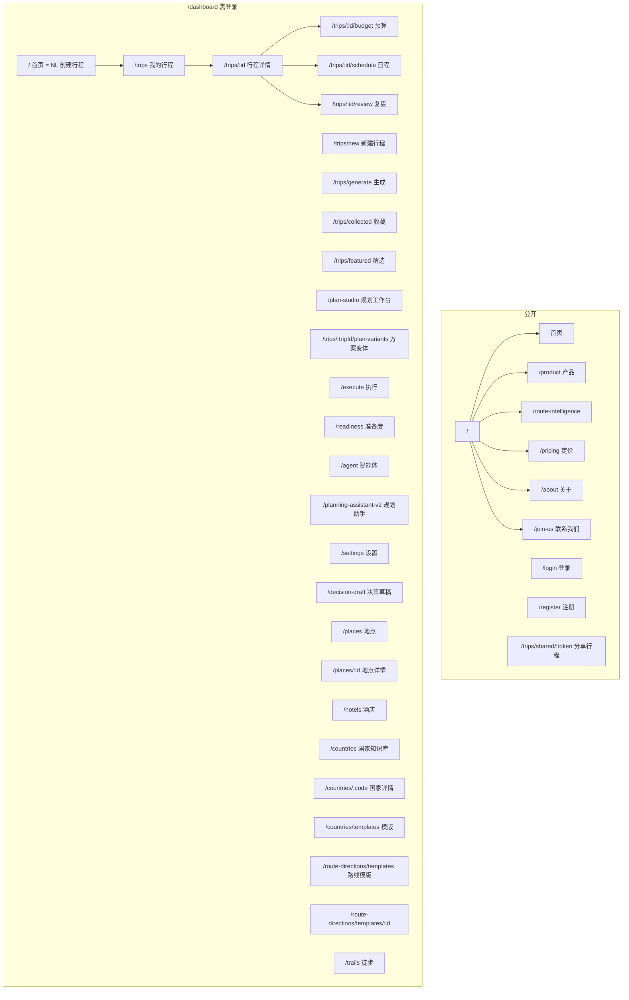
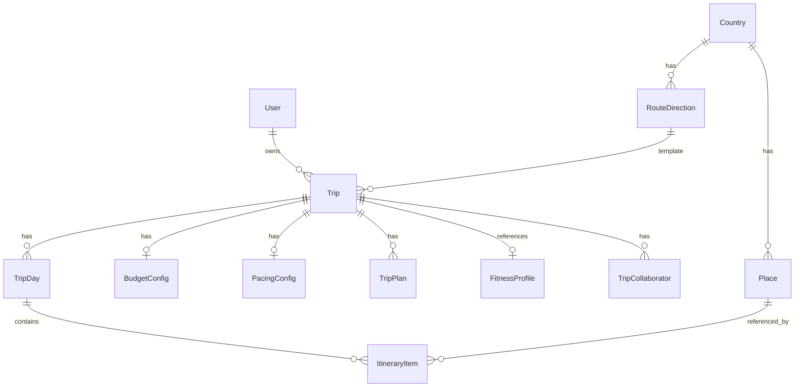

# TripNARA 系统信息架构图

> 梳理当前系统的页面结构、导航层级、数据实体与核心流程

---

## 一、整体架构概览

```
┌─────────────────────────────────────────────────────────────────────────────┐
│                           TripNARA 应用架构                                    │
├─────────────────────────────────────────────────────────────────────────────┤
│  公开区                     │  需登录区 (Dashboard)                             │
│  · 官网首页/产品/定价       │  · 新行程（NL 对话）                               │
│  · 登录/注册                │  · 我的行程 / 行程详情                            │
│  · 分享行程 (shared)        │  · 规划工作台 / 执行 / 准备度                       │
│                             │  · 路线模版 / 国家知识库 / 徒步                     │
└─────────────────────────────────────────────────────────────────────────────┘
```

---

## 二、路由与页面结构

### 2.1 路由树



### 2.2 侧边栏主导航（MainSidebar）

| 层级 | 入口 | 路径 | 说明 |
|------|------|------|------|
| 1 | 新行程 | /dashboard | 自然语言创建行程（NLChatInterface） |
| 2 | 我的行程 | /dashboard/trips | 行程列表 |
| 3 | 路线模版 | /dashboard/route-directions/templates | 路线模版列表 |
| 4 | 国家知识库 | /dashboard/countries | 国家列表 |
| 5 | 徒步 | /dashboard/trails | 徒步路线 |
| 6 | 收藏 | 展开列表 | 收藏的行程（可展开） |
| 7 | 规划中 | 展开列表 | 状态=PLANNING 的行程 |
| 8 | 进行中 | 展开列表 | 状态=IN_PROGRESS 的行程 |
| 9 | 用户头像 | 下拉菜单 | 设置、帮助、退出 |

---

## 三、行程详情页结构

### 3.1 一级 Tab

| Tab | 值 | 说明 |
|-----|-----|------|
| 总览 | overview | 行程概览、天气、健康度、建议 |
| 规划 | plan | 问题与改进 + 智能优化 |
| 执行 | execute | 执行阶段（IN_PROGRESS 时显示） |
| 洞察 | insights | 洞察分析 |
| 预算 | budget | 预算管理 |

### 3.2 规划 Tab 二级结构

| 子 Tab | 值 | 说明 |
|--------|-----|------|
| 问题与改进 | issues | 安全(Abu) / 节奏(Dre) / 修复(Neptune) |

| 子 Tab | 值 | 说明 |
|--------|-----|------|
| 智能优化 | optimize | 评估、协商、优化、风险评估 |

### 3.3 问题与改进 三级 Tab

| 子 Tab | 值 | 说明 |
|--------|-----|------|
| 安全 | abu | Abu 视图 |
| 节奏 | dre | Dr.Dre 视图 |
| 修复 | neptune | Neptune 视图 |

---

## 四、核心数据实体

### 4.1 实体关系



### 4.2 主要实体

| 实体 | 说明 | 关键字段 |
|------|------|----------|
| Trip | 行程 | id, name, destination, startDate, endDate, status, budgetConfig, pacingConfig |
| TripDay | 行程天 | id, date, dayNumber, ItineraryItem |
| ItineraryItem | 行程项 | id, type, Place, startTime, endTime |
| BudgetConfig | 预算配置 | totalBudget, currency, dailyBudget |
| PacingConfig | 节奏配置 | travelers, maxDailyActivities, drivingFatiguePreferences |
| Place | 地点 | id, nameCN, nameEN, category, address |
| RouteDirection | 路线方向 | id, name, countryCode, constraints |
| Country | 国家 | countryCode, name |

### 4.3 行程状态流转

```
PLANNING → IN_PROGRESS → COMPLETED
    ↓              ↓
CANCELLED      CANCELLED
```

---

## 五、API 模块划分

| 模块 | 路径/文件 | 用途 |
|------|-----------|------|
| 行程 | /trips, trips.ts | CRUD、NL 创建、日程 |
| 行程详情 | trip-detail.ts | 健康度、指标、冲突 |
| 规划工作台 | planning-workbench.ts | 执行规划、方案对比 |
| 规划助手 V2 | planning-assistant-v2/ | 会话、聊天、推荐 |
| 优化 V2 | optimization-v2.ts | 评估、协商、优化、风险评估 |
| 体能 | fitness.ts, fitness-analytics.ts | 体能画像、问卷 |
| 准备度 | readiness.ts | 准备度检查 |
| 执行 | execution.ts | 执行相关 |
| 决策 | decision.ts, decision-draft.ts | 决策记录 |
| 地点 | places.ts | 地点 CRUD |
| 国家 | countries.ts | 国家、模版 |
| 路线 | route-directions.ts | 路线方向、模版 |
| 天气 | weather.ts | 天气 |
| 认证 | auth.ts | 登录、注册、刷新 |

---

## 六、核心用户流程

### 6.1 创建行程（NL 对话）

```
Dashboard (NLChatInterface)
  → 用户输入自然语言
  → POST /trips/from-natural-language
  → 返回 clarificationQuestions / trip
  → 澄清 → 创建成功 → 跳转 /plan-studio?tripId=xxx
```

### 6.2 规划行程

```
行程详情 (规划 Tab) / 规划工作台
  → 问题与改进：Abu / Dre / Neptune 视图
  → 智能优化：评估、协商、优化、风险评估
  → 应用优化 → 更新行程
```

### 6.3 执行行程

```
行程详情 (执行 Tab) / 执行页 (/execute)
  → 按天执行
  → 日程调整、替换、反馈
```

---

## 七、上下文与布局

### 7.1 DashboardLayout 结构

```
┌─────────────────────────────────────────────────────────────────┐
│ MainSidebar (左)  │  Main Content (Outlet)  │  AgentChatSidebar (右) │
│ · 新行程          │  · 页面内容              │  · AI 助手对话（可选）   │
│ · 我的行程        │                         │  · 规划工作台 / 执行页   │
│ · 路线模版        │                         │    显示时固定           │
│ · 国家知识库      │                         │                         │
│ · 徒步            │                         │                         │
│ · 收藏/规划中/进行中│                         │                         │
│ · 用户头像        │                         │                         │
└─────────────────────────────────────────────────────────────────┘
```

### 7.2 入口点 (EntryPoint)

| 路径 | 入口点 |
|------|--------|
| /dashboard | dashboard |
| /dashboard/trips | trip_list_page |
| /dashboard/trips/:id | trip_detail_page |
| /dashboard/plan-studio | planning_workbench |
| /dashboard/execute | execute |

---

## 八、文档版本

- 版本：1.0
- 更新日期：2026-02
- 基于：App.tsx、MainSidebar、DashboardLayout、trips/[id].tsx、API 结构
