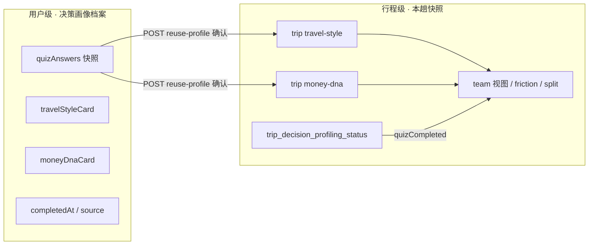

# 决策风格画像 · 跨行程沿用 PRD + API 草案

> **状态**：草案（待评审）  
> **关联模块**：PDI-4 决策风格画像、`trip-decision-profiling`、L4 Money DNA（`GET /users/me/money-dna`）  
> **前端入口**：规划工作台右上角「决策画像」、`DecisionProfilingQuizDialog`  
> **版本**：v0.2 · 2026-06-20（含 §13 评审纪要）

---

## 1. 背景与问题

### 1.1 现状

| 维度 | 当前行为 |
|------|----------|
| 数据粒度 | Travel Style / Money DNA **按行程**存储（`trip_decision_profiling_*`） |
| 新行程 onboarding | `travelStyleCompleted` / `quizCompleted` 默认 **false**，需重新走 5+5 题 |
| 推断预览 | 后端可能返回低置信度卡片（如 48%），但 **不解锁** 分摊共识等门禁 |
| 用户级 Money DNA | `GET /users/me/money-dna` 来自 **行后反馈**，与 Quiz 数据源不同 |

### 1.2 用户痛点

- 第二次及以后创建行程，重复答相同情境题，**5–8 分钟**感知为「又填一遍表」。
- UI 同时展示「初步推断卡片」+「开始调查」Banner，**不清楚要不要重做**。
- 产品意图是每趟团队对齐，但 **个人风格相对稳定**，不必每趟从零答题。

### 1.3 目标

| 目标 | 指标（P1 验收） |
|------|----------------|
| 减少重复答题 | 有历史 Quiz 的用户，**≥ 60%** 选择「沿用上次」而非完整答题 |
| 保持团队对齐 | 摩擦矩阵、分摊共识仍 **按本趟 trip + 本趟队友** 计算 |
| 不混淆数据源 | Quiz 沿用 vs L4 反馈派生 Money DNA 边界清晰 |
| 可微调 | 沿用后可 PATCH 备注或「重新答题」覆盖 |

### 1.4 非目标（v1 不做）

- 自动静默沿用（无用户确认即写入本 trip）
- 分摊机制共识跨行程继承（必须本趟团队确认）
- 将 Quiz Money DNA 与 Odyssey MBTI / L4 向量合并存储（见 travel-budget-four-layer-prd A6）

---

## 2. 产品原则

1. **个人画像可沿用，团队结论每趟重算**  
   Travel Style / Money DNA 是「我是谁」；摩擦预警 / 分摊共识是「我们和谁、这趟怎么处」。

2. **沿用 = 显式确认，不是后台偷偷复制**  
   一键沿用是一次用户动作，等价于「我确认上次答案仍适用于这次旅行」。

3. **推断 ≠ 完成**  
   低置信度推断只作预览；沿用或正式提交 Quiz 后才标记 `quizCompleted`。

4. **Quiet confidence**  
   沿用入口文案强调「节省时间」，不贴「你上次是节俭型」等标签羞辱向表述。

---

## 3. 概念模型



### 3.1 数据源优先级（沿用候选）

后端为「可否沿用」选择档案时，按优先级：

| 优先级 | 来源 | 说明 |
|--------|------|------|
| 1 | 用户最近一次 **正式 Quiz 完成**（任意历史 trip） | `source: quiz \| quiz_edited`，confidence 通常 ≥ 0.65 |
| 2 | 用户级 Quiz 档案表（见 4.1） | 行程完成后 upsert |
| 3 | **不自动沿用** | 仅 `inferred` 预览；展示完整调查或「先答题」 |

> `GET /users/me/money-dna`（L4 反馈）**不作为**沿用数据源 v1；可在 onboarding 文案中提示「行后反馈会逐步校准」，但不写入 trip Quiz 快照。

### 3.2 `source` 枚举扩展

| 值 | 含义 |
|----|------|
| `quiz` | 本趟正式答题 |
| `quiz_edited` | 本趟答题 + 用户备注 |
| `reused` | 本趟一键沿用，未改备注 |
| `reused_edited` | 沿用后 PATCH 备注 |
| `inferred` | 推断预览，**不算完成** |

---

## 4. 后端数据模型（草案）

### 4.1 新表：`user_decision_profiling_profile`

用户级 **Quiz 档案**（每次用户在任意 trip 正式完成 Quiz 后 upsert）。

| 字段 | 类型 | 说明 |
|------|------|------|
| `userId` | PK | |
| `travelStyleAnswers` | JSON | `[{ questionId, optionId }]` 最后一次有效提交 |
| `travelStyleCard` | JSON | 与 `TravelStyleCard` 同构（去掉 trip 维度） |
| `moneyDnaAnswers` | JSON | 同上 |
| `moneyDnaCard` | JSON | 与 `MoneyDnaCard` 同构 |
| `lastCompletedTripId` | string | 档案来源行程（展示「上次：冰岛自驾」） |
| `lastCompletedAt` | datetime | |
| `quizVersion` | string | 题库版本，用于检测题目变更 |

### 4.2 扩展：`trip_decision_profiling_status`

| 新增字段 | 类型 | 说明 |
|----------|------|------|
| `travelStyleSource` | enum | `null \| quiz \| reused \| inferred` |
| `moneyDnaSource` | enum | 同上 |
| `reusedFromTripId` | string? | 沿用来源 trip |
| `reusedAt` | datetime? | |

### 4.3 题库版本

`GET .../quiz` 响应增加 `quizVersion`（如 `ts-md-v1`）。若用户档案 `quizVersion` 与当前不一致：

- `reuseEligible = false`
- 前端引导「题目已更新，请重新完成调查（约 5 分钟）」

---

## 5. API 草案

**Base**：`/api/trips/:tripId/decision-profiling`  
**响应格式**：与现有模块一致 `{ success, data, error }`

### 5.1 扩展 `GET .../onboarding`

在现有字段基础上增加：

```json
{
  "success": true,
  "data": {
    "tripId": "trip-new",
    "userId": "user-a",
    "travelStyleCompleted": false,
    "moneyDnaCompleted": false,
    "quizCompleted": false,
    "teamCompletionRate": 0,

    "reuse": {
      "eligible": true,
      "quizVersion": "ts-md-v1",
      "profileQuizVersion": "ts-md-v1",
      "lastCompletedAt": "2026-05-10T08:00:00.000Z",
      "lastCompletedTripLabel": "冰岛环岛 · 5月",
      "preview": {
        "travelStyleLabel": "理性探索者",
        "moneyDnaSummary": "体验倾向偏高 · 消费节奏均衡",
        "confidence": { "travelStyle": 0.72, "moneyDna": 0.68 }
      },
      "blockedReason": null
    }
  }
}
```

| `reuse.blockedReason` | 场景 |
|-----------------------|------|
| `null` | 可沿用 |
| `no_profile` | 从未正式完成 Quiz |
| `quiz_version_mismatch` | 题库升级 |
| `profile_stale` | 超过 24 个月（可配置） |
| `inferred_only` | 仅有推断，无 Quiz 档案 |

**前端逻辑**：

- `eligible && !quizCompleted` → Banner 展示 **沿用上次** + **重新调查**
- `!eligible && preview 推断存在` → 保持现有「初步推断 + 完善调查」
- `quizCompleted` → 沿用入口隐藏

### 5.2 新 `GET .../my/profile-reuse-preview`

可选：与 onboarding 内嵌 `reuse` 重复时 **可省略**；若拆分则供弹窗专用，避免 onboarding 过重。

响应：`reuse.preview` + 完整 `travelStyleCard` / `moneyDnaCard` 摘要（不含他人数据）。

### 5.3 新 `POST .../my/reuse-profile`

**用途**：用户确认将用户级档案复制到 **当前 trip**，等价于完成两段 Quiz。

**请求体**：

```json
{
  "sections": ["travel_style", "money_dna"],
  "userNote": "这次更偏向即兴，但大体和上次一样"
}
```

| 字段 | 必填 | 说明 |
|------|------|------|
| `sections` | 是 | 默认两项全传；允许只沿用一段（另一段仍须答题） |
| `userNote` | 否 | 写入 Travel Style `userNote`；有值时 `source = reused_edited` |

**响应**：

```json
{
  "success": true,
  "data": {
    "onboarding": {
      "travelStyleCompleted": true,
      "moneyDnaCompleted": true,
      "quizCompleted": true,
      "teamCompletionRate": 33
    },
    "travelStyle": { "...TravelStyleCard...", "source": "reused_edited" },
    "moneyDna": { "...MoneyDnaCard...", "source": "reused" }
  }
}
```

**副作用**：

1. 写入本 trip `travel-style` / `money-dna` 快照（与 POST quiz 同结构）
2. 更新 `trip_decision_profiling_status`
3. **不**更新用户级档案（除非附带 `userNote` 且产品决定同步 — v1 **仅写 trip + PATCH 备注走原 PATCH**）
4. 异步触发摩擦矩阵重算（与现有 POST quiz 一致）

**错误码**：

| HTTP | code | 场景 |
|------|------|------|
| 400 | `REUSE_NOT_ELIGIBLE` | `blockedReason` 非空 |
| 400 | `SECTION_ALREADY_COMPLETED` | 本趟该段已完成 |
| 403 | `FORBIDDEN` | 非成员 |

### 5.4 新 `POST .../my/quiz-prefill`

**用途**：「微调后沿用」— 打开调查弹窗时预填选项，**不**标记完成。

**响应**：

```json
{
  "success": true,
  "data": {
    "prefill": {
      "travelStyleAnswers": [{ "questionId": "ts_q1", "optionId": "c" }],
      "moneyDnaAnswers": [{ "questionId": "md_q1", "optionId": "b" }],
      "userNote": "上次备注…"
    },
    "source": "user_profile"
  }
}
```

用户改题后仍走现有 `POST .../my/travel-style` / `money-dna`，`source` 为 `quiz` / `quiz_edited`。

### 5.5 现有接口行为补充

| 接口 | 补充 |
|------|------|
| `POST .../my/travel-style` | 完成后 upsert `user_decision_profiling_profile` |
| `POST .../my/money-dna` | 同上；两段都完成时刷新用户档案 |
| `GET .../my/travel-style` | 推断预览 `source: inferred` 时 **不** 设 `travelStyleCompleted` |
| `GET .../friction-radar` | 成员 `quizCompleted` 含 `reused` 路径 |

---

## 6. 前端 UX 方案

### 6.1 决策画像 Banner（`DecisionProfilingBanner`）

当 `reuse.eligible && !quizCompleted`：

```
┌─────────────────────────────────────────────────────────────┐
│ ✨ 决策风格画像 · 行前小调查                                 │
│ 上次「冰岛环岛」的结果仍可用（理性探索者 · 体验倾向偏高）      │
│                                                             │
│  [沿用上次结果]     [重新调查]                               │
└─────────────────────────────────────────────────────────────┘
```

- **沿用上次结果**：`POST reuse-profile` → toast「已沿用上次调查」→ reload onboarding + 卡片
- **重新调查**：打开 `DecisionProfilingQuizDialog`；若有 prefill，先 `GET quiz-prefill` 填答案

`reuse.eligible === false` 时保持现有文案（推断预览 / 开始调查）。

### 6.2 沿用确认轻弹层（可选 v1.1）

点击「沿用」前二次确认：

- 展示 Travel Style 标签 + Money DNA 四轴缩略
- 可选备注输入框（对应 `userNote`）
- 说明：「团队摩擦与分摊仍按本趟队友重新计算」

v1 可合并为 Banner 直接沿用 + toast，减少弹层。

### 6.3 调查弹窗（`DecisionProfilingQuizDialog`）

- 从「重新调查」进入：题目预填 + 进度条已满
- 从「微调备注」进入 Travel Style 最后一题：聚焦备注框

### 6.4 Travel Style 卡片（`TravelStyleCardView`）

| 状态 | 展示 |
|------|------|
| `source: inferred` | 琥珀条「初步推断」 |
| `source: reused*` | 灰条「已沿用上次调查 · 可重新调查或编辑备注」 |
| `source: quiz*` | 无额外条 |

### 6.5 Agent `decision_profiling` payload 扩展

`payload.decision_profiling.onboarding.reuse.eligible` 为 true 时，`agentIntroZh` 可增加：

> 「你上次已完成决策风格调查，这次可以直接沿用，大约 10 秒。」

`clientNavigation` 可增加 `action: 'reuse_profile' | 'open_quiz'`。

---

## 7. 用户流程

### 7.1 回头客 · 一键沿用（主路径）

```text
进入新行程 Plan Studio
  → GET onboarding（reuse.eligible = true）
  → 点击「沿用上次结果」
  → POST reuse-profile
  → quizCompleted = true（本人）
  → 解锁分摊共识（本人侧）
  → 摩擦矩阵待队友完成
```

**耗时目标**：≤ 15 秒（含一次点击）。

### 7.2 微调后沿用

```text
点击「重新调查」
  → GET quiz-prefill
  → 改 1–2 题或只改备注
  → POST travel-style → POST money-dna
  → 更新用户级档案 + 本 trip 快照
```

### 7.3 首次用户

```text
reuse.eligible = false（no_profile）
  → 完整 5+5 题
  → 完成后写入用户级档案（供下次沿用）
```

---

## 8. 与预算 / 分摊的关系

| 模块 | 沿用后行为 |
|------|------------|
| 分摊机制共识 | 本人 `quizCompleted` 后可进入选方案；推荐模式仍基于 **本趟团队** Money DNA |
| Travel Wallet L3 | 锁定规则仍须本趟 `split-consensus` 全员 confirm，**不继承** |
| 预算 L2 预填（P2） | 可另读 `GET /users/me/money-dna` 或用户档案，与 Quiz 沿用 **并行**，不在本 PRD 阻塞 |

---

## 9. 埋点与验收

| 事件 | 属性 |
|------|------|
| `decision_profiling_reuse_shown` | `tripId`, `eligible`, `blockedReason` |
| `decision_profiling_reuse_confirmed` | `tripId`, `sections`, `hasNote` |
| `decision_profiling_quiz_started` | `tripId`, `entry: banner \| agent \| reuse_fallback` |
| `decision_profiling_quiz_completed` | `tripId`, `path: quiz \| reused` |

**验收用例**：

1. 用户在 trip-A 完成 Quiz → 创建 trip-B → Banner 出现沿用 → 点击后 `quizCompleted=true`，卡片 `source=reused`。
2. trip-B 队友未完成 → 摩擦矩阵 `completionRate` 正确，分摊可模拟但提示团队未完成。
3. 题库 `quizVersion` 变更 → `eligible=false`，强制完整调查。
4. 仅有推断预览 → 无沿用按钮，仅有「完善调查」。
5. 沿用后 PATCH 备注 → `source=reused_edited`，不触发重新答题。

---

## 10. 实施分期

| 阶段 | 范围 | 预估 |
|------|------|------|
| **P0** | 用户档案表 + `POST reuse-profile` + onboarding `reuse` 字段 + Banner 双按钮 | 后端 3d + 前端 2d |
| **P1** | `quiz-prefill` + 弹窗预填 + Agent payload | 2d |
| **P2** | 沿用确认弹层 + 档案过期策略 + 埋点 dashboard | 2d |

### 10.1 前端文件映射（实现时）

| 文件 | 改动 |
|------|------|
| `src/types/trip-decision-profiling.ts` | `ReuseEligibility`, `source` 扩展 |
| `src/api/trip-decision-profiling.ts` | `reuseProfile`, `getQuizPrefill` |
| `src/hooks/useDecisionProfiling.ts` | `useProfileReuse` |
| `DecisionProfilingBanner.tsx` | 双 CTA |
| `DecisionProfilingQuizDialog.tsx` | prefill |
| `TravelStyleCardView.tsx` | `reused` 状态条 |

---

## 11. 开放问题（评审待定）

| # | 问题 | 建议默认 |
|---|------|----------|
| Q1 | 沿用是否同步更新用户级档案？ | v1 **不更新**；仅 trip 快照 |
| Q2 | 档案多久过期？ | 24 个月或 `quizVersion` 变更 |
| Q3 | 是否允许只沿用 Travel Style、单独做 Money DNA？ | **允许** `sections` 分段 |
| Q4 | 沿用后是否还展示 Banner？ | 仅 `teamCompletionRate < 95%` 时展示团队进度条 |
| Q5 | 推断预览是否应在有档案时隐藏？ | **隐藏**推断条，改展示档案 preview |

---

## 12. 修订记录

| 日期 | 版本 | 说明 |
|------|------|------|
| 2026-06-20 | v0.1 | 初稿：沿用 PRD + API 草案 |
| 2026-06-20 | v0.2 | 追加 §13 产品 / 架构 / 视觉三方评审纪要 |

---

## 13. 多方评审纪要（2026-06-20）

> **评审对象**：v0.1 草案  
> **参与角色**：产品经理（Danny）、技术架构师、视觉设计师  
> **综合结论**：**方向通过，可进入 P0 研发**；须在开工前锁定 §13.4 五项决议。

### 13.1 产品经理评审（Danny）

**总评**：**个人可沿用、团队每趟重算** 与 TripNARA Decision-first 一致；显式确认而非静默复制，符合 **Friction is intentional**。痛点与指标清晰，与分摊共识门禁逻辑衔接正确。

| 维度 | 评价 |
|------|------|
| 问题定义 | ✅ 重复 5+5 题 vs 推断预览矛盾，抓准 |
| 范围切割 | ✅ 非目标列得清楚（分摊不继承、不合并 L4） |
| 用户价值 | ✅ 回头客 ≤15s vs 5–8min，ROI 明确 |
| 团队对齐 | ✅ 摩擦 / 分摊仍 per-trip，不削弱协作叙事 |

**必须补强（写入 PRD v0.2）**：

1. **主 CTA 优先级**：`reuse.eligible` 时 **「沿用上次结果」为 Primary**，「重新调查」为 Outline — 指标 60% 沿用率依赖默认路径，不能双按钮视觉平权。
2. **分段沿用（Q3）降级到 P1**：v1 只支持 **两段一起沿用**；`sections` 数组保留于 API，但前端不暴露「只沿用 Travel Style」— 避免半完成态与 Banner 文案爆炸。
3. **Match Square 陌生人组队**：文案必须出现 **「本趟队友不同，摩擦与分摊仍会重新计算」** — 消除「沿用 = 全队搞定」误解。
4. **成功指标拆分**：除 `reuse_confirmed` 率外，增加 **沿用后 24h 内无 `quiz_started` 回退率**（衡量是否误沿用）。
5. **与 Agent 编排顺序**：沿用能力上线后，`decision_profiling` 与 `process_fairness` 触发顺序不变；沿用 **不替代** F3 结构化协商。

**开放问题决议（PM 拍板）**：

| # | 决议 |
|---|------|
| Q1 | v1 沿用 **不回写** 用户档案；仅 PATCH 备注更新本 trip 卡片 |
| Q2 | 过期：**24 个月** + `quizVersion` 变更；`profile_stale` 文案「很久没更新了，建议花 5 分钟确认」 |
| Q4 | 本人沿用后 Banner **收起调查 CTA**，仅 `teamCompletionRate < 95%` 显示琥珀团队进度条 |
| Q5 | 有档案 preview 时 **隐藏 inferred 琥珀条**，避免双叙事 |

**风险登记**：

| 风险 | 缓解 |
|------|------|
| 用户沿用过时画像（如婚后消费观变化） | P1 确认弹层 + 「重新调查」始终可见 |
| 60% 指标难达（用户不知道有沿用） | Agent 话术 + 决策画像 Hub badge |
| 与预算 L2 预填叙事冲突 | UI 不写「已同步预算」，仅写「解锁分摊推荐」 |

### 13.2 技术架构师评审

**总评**：数据分层合理（用户档案 + trip 快照）；API 增量友好。预估 **P0 后端 3d 可行**，前提是 migration 与 upsert 路径在 **现有 POST quiz 收口** 一处实现，避免双写遗漏。

**架构建议**：

1. **档案表 vs 扫历史 trip**：优先 **独立表 `user_decision_profiling_profile`**，不在 reuse 时扫描全表 trip；完成 Quiz 时 upsert。历史 trip **一次性 backfill 脚本**（可选）。
2. **省略 `GET profile-reuse-preview`**：P0 仅扩展 `onboarding.reuse`，减少接口与缓存分叉；Hub 弹窗数据同源。
3. **`reuse-profile` 事务边界**：单事务内 — 写 trip 两段卡片 + 更新 status + 发 friction 重算 job；失败全回滚，避免 `travelStyleCompleted=true` 但 money 缺失。
4. **`source` 类型统一**：`TravelStyleCard` / `MoneyDnaCard` 均扩展 `source` 枚举；前端 `normalize-decision-profiling.ts` 一处映射。
5. **幂等**：同一 trip 重复 `POST reuse-profile` → 200 返回当前态（或 400 `SECTION_ALREADY_COMPLETED`），禁止双份快照。
6. **并发**：用户同时「沿用」与「提交 quiz」→ 以 **quiz POST 胜出**（时间戳最新 wins），reuse 返回 400 `SECTION_ALREADY_COMPLETED`。

**数据迁移**：

```text
add user_decision_profiling_profile
alter trip_decision_profiling_status (+ source columns)
backfill: INSERT profile FROM latest completed trip per user (one-off job)
```

**前端契约**：

- `OnboardingStatus` 扩展 `reuse?: ReuseEligibility`（可选字段，旧后端兼容）
- `useProfileReuse(tripId)` hook：`reuse()` + `reusing` state；成功后 `reload` onboarding + travel style + money dna + split consensus
- Feature flag：`DECISION_PROFILING_REUSE_ENABLED`（env），后端未就绪时 Banner 不展示双按钮

**测试清单（契约）**：

- eligible / each blockedReason
- quiz_version_mismatch
- reuse 后 friction-radar `completedCount` +1
- split-consensus `enabled` 随 `quizCompleted`
- inferred GET travel-style 不 flip completed flags

**工期修订**：P0 前端 **2.5d**（含 gate-confirm 视觉态复用 + flag）；P1 prefill **1.5d**。

### 13.3 视觉设计师评审

**总评**：Banner 双 CTA 方向正确，但须纳入现有 **决策画像 / gate-confirm** 语义，避免又一种「primary 满屏」促销感。

**视觉规范（P0 必须）**：

| 元素 | 规范 |
|------|------|
| 可沿用 Banner | 边框 `border-gate-confirm-border`、底 `bg-gate-confirm/40`（与分摊门禁、推断条同一族） |
| Primary CTA | `沿用上次结果` — `Button` default，**单一主按钮** |
| Secondary | `重新调查` — `variant="outline"` 或 `ghost` |
| 图标 | 沿用：**`ClipboardCheck` 或 `History`**；勿用 Sparkles（Sparkles = 新调查） |
| 推断 vs 沿用 | inferred → **琥珀**；reused → **muted / border-border bg-muted/30**（安静、已签收） |
| 团队进度条 | 沿用现有琥珀条，与 `DecisionProfilingBanner` 已完成分支一致 |

**信息层级**：

```text
标题（sm font-medium）
  → 一行证据（xs muted）：上次行程名 + 风格标签 · Money 摘要
  → 一行约束（xs muted）：团队摩擦与分摊仍按本趟计算
  → 操作区：Primary + Secondary，sm 高度 h-8
```

**禁止**：

- 双 Primary 并排
- 「你上次是 XX 型」大号人格标签（羞辱向 / 算命感）
- 沿用成功用 celebration 动效；仅 **toast 克制确认** + 卡片区 muted 条更新

**P1 确认弹层（若做）**：

- 复用 `Dialog` + `max-w-md`，非全屏
- 底部 **签收式** 文案：「我确认以上仍适用于这次旅行」+ 主按钮「确认沿用」
- Money DNA 四轴用现有 `MoneyDnaRadar` **缩略态**（直径 ≤120px）

**无障碍**：沿用按钮 `aria-label` 含上次行程名；loading 态 `aria-busy`。

### 13.4 开工前锁定决议（Action Items）

| # | 决议 | 负责人 |
|---|------|--------|
| A1 | P0 仅「两段一起沿用」，不分段 UI | PM ✅ |
| A2 | `onboarding.reuse` 承载 preview，砍掉独立 preview GET | 架构 ✅ |
| A3 | Banner 视觉走 gate-confirm token + Primary/Outline 层级 | 视觉 ✅ |
| A4 | Quiz 完成 upsert 档案 — 与 reuse-profile 同一服务模块 | 后端 |
| A5 | 前端 feature flag + 契约测试 6 条 | 前端 |

**下一步**：PRD 升 v0.2 → 后端开 migration 草案 → 前端并行 stub API + Banner（flag 关闭）→ 联调后开 flag。

