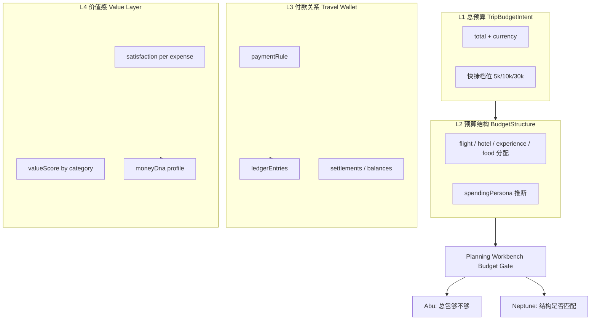

# TripNARA 四层预算系统 PRD（Travel Budget OS）

**文档类型**：产品需求文档 · 后端 API 对齐版  
**版本**：1.0.0  
**编制**：产品 / 前端联合  
**受众**：后端、前端、设计、测试、数据  
**关联文档**：
- `src/api/trips.ts` — 现有 `/trips/:id/budget/*`
- `src/api/planning-workbench.ts` — `POST /planning-workbench/budget/evaluate`
- `docs/api/team-tab-backend-requirements.md` — 团队成员 roster
- `src/types/odyssey-travel-persona.ts` — Travel DNA / Odyssey Intake
- `docs/match-square/frontend-integration-guide.md` — Match Square 组队

**最后更新**：2026-06-16

---

## 1. 文档目的

当前 TripNARA 预算能力以**事后记账 + Agent 门控日志**为主（费用汇总、未支付项、三人格决策日志），与用户真实心智不符。

用户出发前关心的是四层问题：

| 层级 | 用户问题 | 现状 |
|------|----------|------|
| **L1 总预算** | 这次旅行准备花多少钱？ | 有 `BudgetConstraint.total`，藏在设置对话框，无快捷意图输入 |
| **L2 预算结构** | 钱愿意花在哪？（消费人格） | `categoryLimits` 语义是**上限约束**，不是**分配意愿** |
| **L3 付款关系** | 谁付、谁垫、谁欠谁？ | 类型层已有 `paidBy` 字段，**无 Wallet / Ledger / AA API** |
| **L4 价值感** | 花得值不值？ | 无满意度、无 Value Score、Travel DNA 缺 **Money DNA** |

本 PRD 定义四层预算的**产品语义、数据模型、REST API、门控集成、分期交付与验收标准**，供后端对齐实现。

---

## 2. 产品目标与用户价值

### 2.1 产品目标

- 将预算从「财务复盘工具」升级为 **Travel Budget OS**：意图 → 结构 → 分摊 → 价值学习。
- **L1+L2** 作为规划门控输入（Abu / Neptune），在方案生成前即生效。
- **L3** 解决 Match Square / 组队旅行最高频社交摩擦（账算不清）。
- **L4** 跨趟沉淀 **Money DNA**，补全 Travel DNA（兴趣、体力、节奏、风险已有，缺消费维度）。

### 2.2 目标用户

| 用户 | 场景 | 核心诉求 |
|------|------|----------|
| Solo 规划者 | 单人出行 | 快速定总包、明确消费偏好、避免花冤枉钱 |
| 情侣 / 密友 | 2–4 人 | 默认谁买单、AA 规则、垫付结算 |
| Match Square 组队 | 陌生人拼团 | 出发前定分摊规则、行中记账、行后一键结算 |
| 回头客 | 多趟旅行 | 系统记住「体验型 / 品质型」等 Money DNA |

### 2.3 成功指标

| 指标 | 定义 | P0 目标 |
|------|------|---------|
| 预算意图完成率 | 创建行程 7 天内完成 L1 设置的比例 | ≥ 60% |
| 结构完成率 | 设置 L1 后完成 L2 分配的比例 | ≥ 40% |
| 分摊规则设置率 | 组队行程（≥2 人）设置 L3 规则的比例 | ≥ 50% |
| 价值反馈率 | 行程结束后提交 ≥1 条 L4 满意度反馈的比例 | ≥ 25% |
| 预算门控触发率 | evaluate 返回 NEED_CONFIRM 且用户完成签收的比例 | 监控 |

### 2.4 产品哲学约束（TripNARA 硬规则）

- **Decision-first**：L1/L2 是门控输入，不是可选装饰。
- **Evidence is the aesthetic**：L4 Value Score 必须可追溯（哪笔花费、哪条满意度）。
- **Friction is intentional**：结构冲突（L2 vs 实际行程）→ NEED_CONFIRM，需用户签收。
- **Quiet confidence**：UI 克制；Money DNA 是系统推断，不贴「节俭型」大标签羞辱用户。

---

## 3. 概念架构



### 3.1 与现有 API 的关系

| 现有能力 | 处置 |
|----------|------|
| `GET/POST/DELETE /trips/:id/budget/constraint` | **保留并扩展** → 承载 L1；`categoryLimits` **deprecated**，迁移至 L2 `budgetStructure` |
| `GET /trips/:id/budget/summary|details|trends|...` | **保留** → 归入 **Actuals（实际发生）** 子域，与 L1–L2 **Intent（意图）** 并列展示 |
| `PATCH /itinerary-items/:id/cost` + `paidBy` | **扩展** → L3 记账入口 |
| `POST /planning-workbench/budget/evaluate` | **扩展入参** → 增加 `budgetStructure`、结构偏差评估 |
| `GET /planning-workbench/budget/decision-log` | **保留** → 降为辅助，不占预算 Tab 主路径 |

### 3.2 术语表

| 术语 | 英文 | 说明 |
|------|------|------|
| 预算意图 | Budget Intent | L1：用户声明的总包 |
| 预算结构 | Budget Structure | L2：分类分配意愿（总和 = L1） |
| 消费人格 | Spending Persona | 由 L2 比例推断的用户类型 |
| 实际发生 | Actuals | 行程项费用汇总（现有 cost-summary） |
| 旅行钱包 | Travel Wallet | L3：付款规则 + 分账账本 |
| 价值分 | Value Score | L4：满意度 / 金额（按类聚合） |
| 金钱 DNA | Money DNA | 跨趟消费偏好向量 |

---

## 4. 功能需求（按层）

### 4.1 L1 · 总预算（Trip Budget Intent）

#### 4.1.1 用户故事

> 作为规划者，我希望在 10 秒内告诉系统「这次旅行我准备花多少钱」，以便后续推荐和门控有锚点。

#### 4.1.2 功能需求

| ID | 描述 | 优先级 | 验收标准 |
|----|------|--------|----------|
| L1-01 | 设置行程总预算 | P0 | 支持数值输入 + 快捷档位（5000 / 10000 / 30000 / 自定义） |
| L1-02 | 货币单位 | P0 | 默认 CNY；可改为 trip 目的地常用货币 |
| L1-03 | 读取总预算 | P0 | Plan Studio 预算 Tab 首屏展示 L1 |
| L1-04 | 未设置提示 | P0 | 无 L1 时 Banner：`NEED_MORE_INFO`，引导设置 |
| L1-05 | 与 Trip.budgetConfig 同步 | P1 | 写入 `Trip.budgetConfig.totalBudget` 保持 route_and_run 兼容 |
| L1-06 | 日均预算 | P2 | 可选 `dailyBudget`；空则 `total / tripDays` 自动计算 |

#### 4.1.3 业务规则

- `total` 范围：**100 – 10,000,000**（与现 `setBudgetConstraint` 一致）。
- L1 变更不自动改 L2；若 L2 总和 > 新 L1，返回 `structureOverflow: true` 提示用户调整 L2。
- L1 是**意图**，与 Actuals 使用率分开展示（避免「加总行程项 / 总预算」冒充 L1）。

---

### 4.2 L2 · 预算结构（Budget Structure / 消费人格）

#### 4.2.1 用户故事

> 作为规划者，我希望声明「酒店 300、体验 3000」这类分配意愿，让系统知道我是体验型而非品质型。

#### 4.2.2 分类定义

与现有 `CostCategory` 对齐，L2 使用**用户面向四象限**（API 内部仍映射 snake_case）：

| UI 标签 | API 字段 | 映射 CostCategory |
|---------|----------|-------------------|
| 机票/大交通 | `transportation` | TRANSPORTATION |
| 酒店/住宿 | `accommodation` | ACCOMMODATION |
| 体验/活动 | `experience` | ACTIVITIES |
| 餐饮 | `food` | FOOD |
| 其他（可选） | `other` | OTHER |

> **注意**：L2 字段名用 `experience` 而非 `activities`，避免与「活动类型 POI」混淆；响应中同时返回 `activities` 别名以兼容 evaluate API。

#### 4.2.3 功能需求

| ID | 描述 | 优先级 | 验收标准 |
|----|------|--------|----------|
| L2-01 | 设置分类分配（绝对金额） | P0 | 五类金额之和 **必须等于** L1.total（±1 货币单位容差） |
| L2-02 | 设置分类分配（百分比） | P1 | 支持 percent 模式；服务端归一化为金额 |
| L2-03 | 消费人格推断 | P1 | 根据 L2 比例返回 `spendingPersona` + `personaConfidence` |
| L2-04 | 结构 vs 实际偏差 | P0 | 返回 `structureVsActual`：每类 intent / estimated / actual |
| L2-05 | 从 Money DNA 预填 | P2 | 新行程 L2 默认来自用户 `moneyDna.defaultStructure` |
| L2-06 | 结构冲突门控 | P0 | 行程预估与 L2 偏差 > 阈值 → evaluate `NEED_CONFIRM` |

#### 4.2.4 消费人格推断规则（v1 启发式）

服务端根据 L2 占 L1 比例（`other` 计入分母）推断：

| spendingPersona | 条件（占比最高且显著） |
|-----------------|------------------------|
| `experience` | `experience ≥ 35%` 且为最高项 |
| `quality` | `accommodation ≥ 35%` 且为最高项 |
| `frugal` | `accommodation ≤ 15%` 且 `experience ≤ 20%` |
| `efficiency` | `transportation ≥ 30%` 且 `experience ≤ 25%` |
| `balanced` | 不满足以上 |

`personaConfidence`：0–1，基于 top1 与 top2 差值。

#### 4.2.5 与 categoryLimits 迁移

| 旧字段 | 新语义 |
|--------|--------|
| `BudgetConstraint.categoryLimits.*` | **Deprecated** → 读时 merge 到 L2；写时拒绝并返回 400 + migration hint |
| 上限语义 | 若仍需「单类上限」，在 L2 增加可选 `caps`（P2），与 `allocations` 分离 |

---

### 4.3 L3 · 付款关系（Travel Wallet）

#### 4.3.1 用户故事

> 作为组队旅行者，我希望出发前定好「默认 AA / 谁垫酒店」，行中记谁付了多少，行后看到「A 欠 B 200」。

#### 4.3.2 功能需求

| ID | 描述 | 优先级 | 验收标准 |
|----|------|--------|----------|
| L3-01 | 设置付款规则 | P0 | 支持 `split_aa` / `one_pays` / `by_category` / `custom` |
| L3-02 | 默认付款人 | P1 | `one_pays` 模式指定 `defaultPayerId` |
| L3-03 | 分账基数 | P0 | `splitBase`：参与 AA 人数（Match Square roster 同步） |
| L3-04 | 费用记账 | P0 | 每笔 expense 记录 `paidByUserId`、`splitAmongUserIds`、`amount` |
| L3-05 | 欠账摘要 | P0 | `GET balances` 返回 pairwise `from → to → amount` |
| L3-06 | 标记 settled | P1 | 支持单笔 / 批量结算 |
| L3-07 | 自动 AA 建议 | P2 | 根据规则自动生成 ledger 分录 |
| L3-08 | Match Square roster 绑定 | P0 | 参与人来自 trip roster；与 `resolveMatchSquareRosterFromContext` 一致 |

#### 4.3.3 付款规则模式

```typescript
type PaymentRuleMode =
  | 'split_aa'        // 所有费用默认 AA
  | 'one_pays'        // 指定人默认全付（如情侣一方买单）
  | 'by_category'     // 按类指定默认付款策略
  | 'custom';         // 每笔手动指定
```

`by_category` 扩展示例：

```json
{
  "mode": "by_category",
  "categoryRules": {
    "accommodation": { "type": "one_pays", "userId": "u1" },
    "food": { "type": "split_aa" },
    "experience": { "type": "split_aa" }
  }
}
```

#### 4.3.4 与现有 `paidBy` 字段

`ItemCostRequest.paidBy` **已存在**（`src/types/trip.ts`）。L3 要求：

- `paidBy` 存 **userId**（非 displayName）。
- 扩展 `PATCH /itinerary-items/:id/cost` 请求体（见 §6.3）。
- 服务端在 cost 更新时**可选**自动写入 ledger（`autoLedger: true` 默认开启）。

---

### 4.4 L4 · 价值感（Value Score → Money DNA）

#### 4.4.1 用户故事

> 作为旅行者，行程结束后我想标记「这 3000 极光值、这 3000 酒店不值」，让系统下次更懂我。

#### 4.4.2 功能需求

| ID | 描述 | 优先级 | 验收标准 |
|----|------|--------|----------|
| L4-01 | 单笔满意度 | P1 | 1–5 星或 thumbs up/down；关联 expense / itineraryItem |
| L4-02 | 行程价值汇总 | P1 | 按类返回 `valueScore`（见公式） |
| L4-03 | 写入 Money DNA | P2 | 跨趟聚合更新用户 profile |
| L4-04 | 规划建议引用 | P2 | Neptune 可引用「用户对酒店价值敏感」 |
| L4-05 | 批量邀请评价 | P2 | 行程结束 24h 内 push / 邮件（运营配置） |

#### 4.4.3 Value Score 公式（v1）

```
valueScore(category) = avg(satisfaction) / avg(amountNormalized)
```

- `satisfaction`：1–5 映射到 0.2–1.0。
- `amountNormalized`：该笔金额 / 该类历史用户 P50 金额（冷启动用目的地基准价表）。
- 输出：**0–1** 归一化，供 Money DNA 向量使用。

#### 4.4.4 Money DNA 向量（v1）

```typescript
interface MoneyDnaProfile {
  userId: string;
  /** 0–1，越高越愿意为体验付费 */
  experienceSensitivity: number;
  /** 0–1，越高越愿意为住宿付费 */
  accommodationSensitivity: number;
  /** 0–1，越高越倾向交通/效率付费 */
  efficiencySensitivity: number;
  /** 0–1，越高越节俭（全类压缩） */
  frugalityIndex: number;
  dominantPersona: SpendingPersona;
  tripCount: number;           // 参与计算的行程数
  lastUpdatedAt: string;
  confidence: number;          // 0–1
}
```

与 Odyssey Intake 关系：**独立存储**，通过 `GET /users/me/travel-profile` 聚合展示；不覆盖 MBTI 域模型。

---

## 5. 统一资源模型

### 5.1 TripBudgetProfile（行程级聚合）

一次 GET 返回 L1–L4 快照（Actuals 可选 include）：

```typescript
interface TripBudgetProfile {
  tripId: string;
  intent: TripBudgetIntent;           // L1
  structure: BudgetStructure;         // L2
  wallet?: TravelWallet;              // L3，单人行程可 null
  valueSummary?: TripValueSummary;    // L4，行中/行后才有
  actuals?: BudgetActualsSnapshot;    // 现有 summary 精简版
  gateStatus?: BudgetGateStatus;      // 最近一次 evaluate 摘要
  updatedAt: string;
}

interface TripBudgetIntent {
  total: number;
  currency: string;
  dailyBudget?: number;
  source: 'user' | 'imported' | 'inferred';
  setAt: string;
}

interface BudgetStructure {
  mode: 'absolute' | 'percent';
  allocations: {
    transportation: number;
    accommodation: number;
    experience: number;   // = activities
    food: number;
    other?: number;
  };
  /** percent 模式时 0–100 */
  percentages?: {
    transportation: number;
    accommodation: number;
    experience: number;
    food: number;
    other?: number;
  };
  spendingPersona?: SpendingPersona;
  personaConfidence?: number;
  updatedAt: string;
}

type SpendingPersona =
  | 'experience'
  | 'quality'
  | 'frugal'
  | 'efficiency'
  | 'balanced';

interface TravelWallet {
  tripId: string;
  paymentRule: PaymentRule;
  members: WalletMember[];
  ledgerSummary: {
    totalPaid: number;
    totalShared: number;
    unsettledCount: number;
  };
  updatedAt: string;
}

interface PaymentRule {
  mode: PaymentRuleMode;
  defaultPayerId?: string;
  splitBase: number;
  categoryRules?: Record<string, CategoryPaymentRule>;
}

interface WalletMember {
  userId: string;
  displayName: string;
  role?: 'leader' | 'member';
}

interface LedgerEntry {
  id: string;
  tripId: string;
  /** 关联 itinerary item 或 manual expense */
  sourceType: 'itinerary_item' | 'manual';
  sourceId: string;
  title: string;
  category: string;
  amount: number;
  currency: string;
  paidByUserId: string;
  splitAmongUserIds: string[];
  /** 每人分摊额（服务端计算） */
  sharePerPerson: number;
  settled: boolean;
  settledAt?: string;
  createdAt: string;
  updatedAt: string;
}

interface BalanceEdge {
  fromUserId: string;
  toUserId: string;
  amount: number;
  currency: string;
}

interface ValueFeedback {
  id: string;
  tripId: string;
  sourceType: 'itinerary_item' | 'manual';
  sourceId: string;
  amount: number;
  category: string;
  satisfaction: 1 | 2 | 3 | 4 | 5;
  note?: string;
  createdBy: string;
  createdAt: string;
}

interface TripValueSummary {
  byCategory: Record<string, {
    avgSatisfaction: number;
    avgAmount: number;
    valueScore: number;
    feedbackCount: number;
  }>;
  overallValueScore: number;
}
```

### 5.2 BudgetActualsSnapshot（现有能力封装）

```typescript
interface BudgetActualsSnapshot {
  totalEstimated: number;
  totalActual: number;
  currency: string;
  categoryBreakdown: {
    accommodation: number;
    transportation: number;
    food: number;
    activities: number;
    other: number;
  };
  unpaidCount: number;
  budgetUsagePercent?: number;  // totalEstimated / intent.total
}
```

---

## 6. REST API 规格

**基础路径**：`/api/v1/trips/:tripId/budget`（与现有 `/trips/:id/budget/*` 保持一致；若项目统一 v2 前缀则改为 `/api/v2/trips/:tripId/budget`）

**通用响应包装**：沿用 `ApiResponseWrapper<T>`（`success`, `data`, `message`）

**鉴权**：所有写操作需 trip 成员身份；L3 ledger 读操作需 trip 成员；Money DNA 读操作仅本人或 aggregate 脱敏。

---

### 6.1 L1 — 总预算

#### `GET /trips/:tripId/budget/intent`

获取 L1。

**Response 200**

```json
{
  "success": true,
  "data": {
    "total": 10000,
    "currency": "CNY",
    "dailyBudget": 1428,
    "source": "user",
    "setAt": "2026-06-16T08:00:00Z"
  }
}
```

**Response 404**：未设置，`data: null`

---

#### `PUT /trips/:tripId/budget/intent`

创建或全量更新 L1。

**Request**

```json
{
  "total": 10000,
  "currency": "CNY",
  "dailyBudget": null
}
```

**Validation**

| 字段 | 规则 |
|------|------|
| total | required, 100–10000000 |
| currency | ISO 4217，默认 CNY |

**Response 200**：`TripBudgetIntent`

**Response 409**：若 L2 总和 > total

```json
{
  "success": false,
  "code": "STRUCTURE_OVERFLOW",
  "message": "分类结构总和超过新总预算",
  "data": {
    "structureTotal": 12000,
    "newTotal": 10000
  }
}
```

---

#### `DELETE /trips/:tripId/budget/intent`

清除 L1（级联：可选清除 L2，或保留 L2 但标记 stale）。

**Response 200**

---

### 6.2 L2 — 预算结构

#### `GET /trips/:tripId/budget/structure`

**Response 200**：`BudgetStructure` + 扩展字段

```json
{
  "success": true,
  "data": {
    "mode": "absolute",
    "allocations": {
      "transportation": 3000,
      "accommodation": 500,
      "experience": 5000,
      "food": 1500,
      "other": 0
    },
    "spendingPersona": "experience",
    "personaConfidence": 0.82,
    "structureVsActual": {
      "accommodation": { "intent": 500, "estimated": 4200, "variance": 3700 }
    },
    "updatedAt": "2026-06-16T08:05:00Z"
  }
}
```

---

#### `PUT /trips/:tripId/budget/structure`

**Request（absolute 模式）**

```json
{
  "mode": "absolute",
  "allocations": {
    "transportation": 3000,
    "accommodation": 500,
    "experience": 5000,
    "food": 1500,
    "other": 0
  }
}
```

**Request（percent 模式）**

```json
{
  "mode": "percent",
  "percentages": {
    "transportation": 30,
    "accommodation": 5,
    "experience": 50,
    "food": 15,
    "other": 0
  }
}
```

**Validation**

- 必须先有 L1。
- absolute：`sum(allocations) === intent.total`（±1）。
- percent：`sum(percentages) === 100`（±0.01）。

**Response 200**：`BudgetStructure`（含推断的 `spendingPersona`）

---

#### `GET /trips/:tripId/budget/structure/presets`

从用户 Money DNA 返回推荐 L2（P2）。

**Response 200**

```json
{
  "success": true,
  "data": {
    "presets": [
      { "label": "体验型", "spendingPersona": "experience", "percentages": { "...": "..." } }
    ]
  }
}
```

---

### 6.3 L3 — Travel Wallet

#### `GET /trips/:tripId/budget/wallet`

**Response 200**：`TravelWallet`

---

#### `PUT /trips/:tripId/budget/wallet/rule`

**Request**

```json
{
  "mode": "split_aa",
  "splitBase": 4,
  "defaultPayerId": null,
  "categoryRules": null
}
```

**Validation**

- `splitBase >= 1` 且 ≤ roster 人数。
- roster 为空时返回 400 `ROSTER_REQUIRED`。

---

#### `GET /trips/:tripId/budget/wallet/ledger`

**Query**：`?settled=false&limit=50&offset=0`

**Response 200**

```json
{
  "success": true,
  "data": {
    "items": [ "LedgerEntry..." ],
    "total": 12,
    "limit": 50,
    "offset": 0
  }
}
```

---

#### `POST /trips/:tripId/budget/wallet/ledger`

手动记账（非 itinerary item）。

**Request**

```json
{
  "title": "超市补给",
  "category": "food",
  "amount": 280,
  "currency": "CNY",
  "paidByUserId": "user-1",
  "splitAmongUserIds": ["user-1", "user-2", "user-3", "user-4"]
}
```

**Response 201**：`LedgerEntry`

---

#### `PATCH /trips/:tripId/budget/wallet/ledger/:entryId`

更新 settled 状态或分摊人。

**Request**

```json
{ "settled": true }
```

---

#### `GET /trips/:tripId/budget/wallet/balances`

**Response 200**

```json
{
  "success": true,
  "data": {
    "currency": "CNY",
    "edges": [
      { "fromUserId": "u2", "toUserId": "u1", "amount": 350.5 }
    ],
    "netByUser": {
      "u1": 350.5,
      "u2": -350.5
    }
  }
}
```

**算法（v1）**：最小转账边集（optional）；或 pairwise 净额矩阵。

---

#### 扩展 `PATCH /itinerary-items/:id/cost`

在现有 `ItemCostRequest` 上扩展：

```typescript
interface ItemCostRequest {
  estimatedCost?: number;
  actualCost?: number;
  currency?: string;
  costCategory?: CostCategory;
  costNote?: string;
  isPaid?: boolean;
  paidBy?: string;                    // 已有：userId
  /** 新增 L3 */
  splitAmongUserIds?: string[];       // 参与分摊；空则按 wallet.rule 默认
  autoLedger?: boolean;               // 默认 true
}
```

**行为**：当 `isPaid=true` 且 `paidBy` 有值，自动 upsert ledger entry（`sourceType: itinerary_item`）。

---

### 6.4 L4 — 价值感

#### `POST /trips/:tripId/budget/value-feedback`

**Request**

```json
{
  "sourceType": "itinerary_item",
  "sourceId": "item-uuid",
  "satisfaction": 5,
  "note": "极光超值"
}
```

**Validation**

- 同一 user + sourceId 24h 内可更新（upsert）。
- satisfaction 1–5。

**Response 201**：`ValueFeedback`

---

#### `GET /trips/:tripId/budget/value-summary`

**Response 200**：`TripValueSummary`

---

#### `GET /users/me/money-dna`

**Response 200**：`MoneyDnaProfile`

---

#### `POST /users/me/money-dna/recompute`

内部 / 管理接口：行程结束后异步触发；前端不直接调用。

---

### 6.5 聚合与兼容

#### `GET /trips/:tripId/budget/profile`

**Query**：`?include=actuals,wallet,value`

一次返回 `TripBudgetProfile`（Plan Studio 预算 Tab 主接口）。

---

#### 现有接口兼容策略

| 接口 | 策略 |
|------|------|
| `POST /trips/:id/budget/constraint` | 保留；body 中 `categoryLimits` 写拒绝 400；`total` 双写 L1 |
| `GET /trips/:id/budget/constraint` | 保留；响应 merge L1 + 旧 categoryLimits 到 deprecated 字段 |
| `POST /planning-workbench/budget/evaluate` | 扩展 body（§6.6） |

---

### 6.6 扩展 Budget Evaluate（门控）

#### `POST /planning-workbench/budget/evaluate`（扩展）

**Request（新增字段）**

```typescript
{
  planId: string;
  tripId: string;
  estimatedCost: number;
  categoryBreakdown: { accommodation, transportation, food, activities, other };
  budgetConstraint: BudgetConstraint;  // 保留兼容
  /** 新增 */
  budgetIntent?: TripBudgetIntent;
  budgetStructure?: BudgetStructure;
}
```

**Response（扩展 violations）**

```typescript
interface BudgetViolation {
  type:
    | 'TOTAL_EXCEEDED'           // L1 总包超支
    | 'CATEGORY_EXCEEDED'        // 单类超 L2 分配（旧 categoryLimits）
    | 'STRUCTURE_MISMATCH'       // 新增：预估与 L2 结构偏差
    | 'WALLET_UNSET';            // 新增：组队但未设 L3
  category?: string;
  intentAmount?: number;
  estimatedAmount?: number;
  variance?: number;
  variancePercent?: number;
  message: string;
}
```

**门控阈值（v1）**

| 类型 | 条件 | verdict |
|------|------|---------|
| TOTAL_EXCEEDED | estimated > intent.total | NEED_ADJUST / REJECT |
| STRUCTURE_MISMATCH | 单类 `|estimated - intent| / intent > 0.25` | NEED_CONFIRM |
| WALLET_UNSET | roster ≥ 2 且无 paymentRule | NEED_CONFIRM（非 REJECT） |

---

## 7. 前端集成要点（供后端理解调用方）

| 页面 | 主要 API |
|------|----------|
| Plan Studio → 预算 Tab | `GET budget/profile`；`PUT intent` + `PUT structure` |
| Plan Studio → 预算 Tab L3 区块 | `GET wallet` + `GET balances` |
| 行程项费用编辑 | `PATCH itinerary-items/:id/cost`（扩展字段） |
| 行程结束页 | `POST value-feedback` |
| 用户 Profile / Odyssey | `GET money-dna` |
| 规划门控 | `evaluateBudget`（扩展 body） |

---

## 8. 分期交付

### Phase 0（4 周）— L1 + L2 + Profile 聚合

| 交付 | API |
|------|-----|
| L1 CRUD | `intent` GET/PUT/DELETE |
| L2 CRUD + persona 推断 | `structure` GET/PUT |
| 聚合读 | `profile` GET |
| constraint 迁移 shim | 旧 constraint 双写 L1 |
| evaluate 扩展 | STRUCTURE_MISMATCH |

**前端**：重写 Plan Studio BudgetTab（两层主 UI + Actuals 折叠区）

### Phase 1（4 周）— L3 最小可用

| 交付 | API |
|------|-----|
| payment rule | `wallet/rule` PUT |
| ledger CRUD + balances | ledger + balances |
| cost PATCH 扩展 | autoLedger |
| roster 集成 | trip members from team / match-square |

### Phase 2（4 周）— L4 + Money DNA

| 交付 | API |
|------|-----|
| value feedback | POST feedback |
| trip value summary | GET value-summary |
| user money dna | GET money-dna |
| 异步 recompute | 行程 complete 事件 |

### Phase 3（按需）— 完整 Wallet

- 自动 AA 建议、批量结算、导出 CSV、Match Square 招募页预填 L3 规则

---

## 9. 非功能需求

| 类别 | 要求 |
|------|------|
| 性能 | `GET profile` P95 < 200ms（含 actuals cache） |
| 一致性 | L2 写入与 L1 总和校验在 DB 事务内 |
| 并发 | ledger 写入乐观锁 / 版本号 |
| 隐私 | balances 仅 trip 成员可见；Money DNA 仅本人 |
| 审计 | ledger 变更写 audit log（who/when） |
| 国际化 | 金额展示依赖 currency；API 存标准 ISO 4217 |

---

## 10. 埋点（Analytics）

| 事件 | 属性 |
|------|------|
| `budget_intent_set` | tripId, total, currency, source |
| `budget_structure_set` | tripId, spendingPersona, mode |
| `wallet_rule_set` | tripId, mode, splitBase |
| `ledger_entry_created` | tripId, sourceType, amount |
| `value_feedback_submitted` | tripId, category, satisfaction |
| `budget_gate_triggered` | tripId, verdict, violationTypes[] |

---

## 11. 验收标准（E2E）

### P0 验收场景

1. **设置总包**：用户 PUT intent 10000 → GET profile 展示 L1=10000。
2. **设置结构**：PUT structure 五类之和=10000 → 返回 `spendingPersona=experience`。
3. **结构溢出**：L2 总和 12000 → PUT intent 10000 返回 409 STRUCTURE_OVERFLOW。
4. **门控**：行程酒店预估 4200、L2 accommodation=500 → evaluate 含 STRUCTURE_MISMATCH + NEED_CONFIRM。
5. **兼容**：旧客户端 POST constraint `{ total: 8000 }` → L1 同步为 8000。

### P1 验收场景

6. **AA 记账**：4 人 trip，item cost actual=400, paidBy=u1, splitAmong 4人 → balances 每人欠 u1 300。
7. **规则**：PUT rule split_aa → 新 cost 自动 ledger。

### P2 验收场景

8. **价值反馈**：提交 satisfaction=5 on 极光 item → value-summary experience valueScore 上升。
9. **Money DNA**：完成 3 趟行程后 GET money-dna confidence > 0.5。

---

## 12. 待确认清单（Assumptions）

| # | 假设 | 负责人 | 状态 |
|---|------|--------|------|
| A1 | API 前缀沿用 `/trips/:id/budget` 而非新建 `/travel-wallet` | 后端 | 待确认 |
| A2 | roster 来源：优先 trip.teamId → Match Square recruitment roster | 后端 | 待确认 |
| A3 | L2 `experience` 与 evaluate `activities` 双向 alias | 后端 | 建议采纳 |
| A4 | 旧 `categoryLimits` 只读保留 6 个月后移除 | 后端 | 待确认 |
| A5 | Value Score 冷启动用目的地基准价表（需数据团队） | 数据 | P2 依赖 |
| A6 | Money DNA 不与 Odyssey MBTI 分数合并存储 | 产品 | **已确认** |

---

## 13. 附录 A — 现有前端类型映射

| 现有类型 | 路径 | 四层映射 |
|----------|------|----------|
| `BudgetConstraint` | `planning-workbench.ts` | L1 partial + deprecated limits |
| `SetBudgetConstraintRequest` | `trip.ts` | → migrate to intent |
| `ItemCostRequest.paidBy` | `trip.ts` | L3 已有字段 |
| `BudgetEvaluationResponse` | `trip.ts` | Gate；扩展 violations |
| `BudgetSummary` | `trip.ts` | Actuals |
| `OdysseyCognitiveScores.financial_flexibility` | `odyssey-travel-persona.ts` | 与 Money DNA 并列，不合并 |

---

## 14. 附录 B — OpenAPI 标签建议

```
tags:
  - name: trip-budget-intent
  - name: trip-budget-structure
  - name: trip-travel-wallet
  - name: trip-value-feedback
  - name: user-money-dna
```

---

## 15. 修订记录

| 版本 | 日期 | 说明 |
|------|------|------|
| 1.0.0 | 2026-06-16 | 初版：四层模型 + 完整 API 草案 + 分期 |
